# 肥羊的聖誕禮物 — 裝備合成攻略 & 裝備一覽

> 魔獸爭霸 III 地圖《肥羊的聖誕禮物》（原版：**Underground Defence**）裝備資料整理。
> 地圖版本 **UD_v3.81**　·　資料擷取日 2026-09-05　·　整理：CC_lemon
> 共 **442** 件裝備 ＋ **32** 件消耗品／掉落物，其中 **473** 件附有遊戲內圖示。

## 資料來源

| 來源 | 內容 | 用途 |
|---|---|---|
| **`data/items_database.json` + `data/icons/`**<br>（自地圖檔匯出） | 474 件道具的名稱、品質、屬性、能力，以及 407 張 64×64 遊戲原始圖示 | **本文的資料主體**，數值與圖示全部以此為準 |
| `synthesis.xlsx`（女神十一製作合成表） | 40 條合成配方、扭曲／折射流程圖、中文既有譯名 | **合成路線的唯一來源**（地圖物件資料不含配方，配方寫在觸發裡） |
| [felinhart.github.io/udwiki](https://felinhart.github.io/udwiki/items.html) | 俄文 Wiki，431 件裝備 | 僅用來補充「配方／用於」的關聯，**數值已過時、不採用** |

**版本落差說明：**

- 地圖檔的資料比 Wiki 新。兩邊對照後，**93 件裝備的數值不同**、13 件的俄文名不同，
  另有 **6 件裝備 Wiki 完全沒有收錄**（見 [Wiki 未收錄的裝備](#wikimiss)）。
- 最明顯的改版是**傷害拆成「攻擊與技能傷害」與「狀態傷害」兩套**，
  很多裝備因此改寫了加成敘述（見 [狀態系統](#status)）。
- 因此凡是 Wiki 與地圖檔衝突之處，本文一律採用地圖檔。

<a id="status"></a>

## 一、狀態（status）系統

目前版本把傷害拆成兩類，很多裝備的加成只對其中一類生效，看屬性時要特別注意：

| 分類 | 內容 | 屬性寫法 |
|---|---|---|
| **攻擊與技能傷害** | 普攻、英雄技能、裝備 MOD 的直接傷害 | 「攻擊與技能傷害」「非狀態傷害」 |
| **狀態傷害** | 由下列負面狀態造成的持續／延遲傷害 | 「狀態傷害」「點燃傷害」「流血傷害」… |

主要狀態：

| 中文 | 俄文 | 一句話 |
|---|---|---|
| 點燃 | поджог | 在 4 秒內快速造成傷害（每 0.25 秒一跳）。有施加機率。 |
| 易燃 | горючесть | 降低攻擊速度 20%，並強化點燃效果。持續 6 秒。有施加機率。 |
| 流血 | кровотечение | 在 8 秒內造成傷害（每 0.5 秒一跳）。有施加機率。 |
| 疾病 | болезнь | 在 12 秒內緩慢造成傷害（每 0.75 秒一跳）。有施加機率。 |
| 冰凍 | заморозка | 降低攻擊速度與移動速度 30%，持續 6 秒。有施加機率。 |
| 電擊 | шок | 在短時間內大幅削弱目標。持續 4 秒。有施加機率。 |
| 詛咒 | проклятие | 降低攻擊力 33%，並使受到的非狀態傷害提高 20%。強化疾病。持續 8 秒。有施加機率。 |
| 虛弱 | слабость | 降低攻擊速度 10%、移動速度 30%。強化流血。持續 8 秒。有施加機率。 |
| 易傷 | уязвимость | 提高受到其他狀態的機率，並增加受到的反傷。持續 8 秒。有施加機率。 |

※ 以下細節來自玩家提供的遊戲內圖鑑截圖（`data/status/*.jpg`，俄文版），
※ 地圖物件資料沒有這些內容。

### 各狀態細節

#### 點燃（Поджог）　— 會造成傷害

在 4 秒內快速造成傷害（每 0.25 秒一跳）。有施加機率。

**特性**
- 對建築與機械的點燃機率降低 50%
- 火焰抗性（fire resist）使點燃機率降低 75%

**與其他狀態的交互**
- 「易燃」使點燃機率 +50%，並延長 2 秒點燃時間（總點燃傷害 +50%）
- 「電擊」使受到的點燃傷害 +100%
- 「易傷」使點燃機率 +50%

#### 易燃（Горючесть）

降低攻擊速度 20%，並強化點燃效果。持續 6 秒。有施加機率。

**特性**
- 對建築與機械的易燃機率降低 50%
- 火焰抗性（fire resist）使易燃機率降低 75%

**與其他狀態的交互**
- 「易燃」使點燃機率 +50%，並延長 2 秒點燃時間（總點燃傷害 +50%）
- 「易傷」使易燃機率 +50%

#### 流血（Кровотечение）　— 會造成傷害

在 8 秒內造成傷害（每 0.5 秒一跳）。有施加機率。

**特性**
- 無法對建築與機械施加
- 使目標移動速度降低 15%
- 目標每缺少 1% 生命，流血傷害降低 0.75%
- 流血抗性（bleed resist）使流血機率降低 75%

**與其他狀態的交互**
- 「虛弱」使受到的流血傷害 +50%
- 「電擊」使受到的流血傷害 +100%
- 「易傷」使流血機率 +50%

#### 疾病（Болезнь）　— 會造成傷害

在 12 秒內緩慢造成傷害（每 0.75 秒一跳）。有施加機率。

**特性**
- 無法對建築與機械施加
- 使目標攻擊力降低 15%
- 目標每缺少 1% 生命，疾病傷害提高 0.75%
- 「瘟疫（plagued）」狀態賦予疾病免疫

**與其他狀態的交互**
- 「詛咒」使受到的疾病傷害 +50%
- 「電擊」使受到的疾病傷害 +100%
- 「易傷」使疾病機率 +50%

#### 冰凍（Заморозка）

降低攻擊速度與移動速度 30%，持續 6 秒。有施加機率。

**特性**
- 無法對建築與機械施加
- 被冰凍的目標受到「穿透」效果的傷害 +75%
- 對已冰凍的目標再次施加會解除冰凍，並造成目標最大生命 5% 的傷害（對英雄為 2.5%）
- 冰凍抗性（cold resist）使冰凍機率降低 75%

**與其他狀態的交互**
- 「易傷」使冰凍機率 +50%

#### 電擊（Шок）

在短時間內大幅削弱目標。持續 4 秒。有施加機率。

**特性**
- 無法對建築與機械施加
- 對英雄的施加機率降低 50%
- 降低攻擊速度與移動速度 30%、降低造成的傷害 30%、提高受到的非狀態傷害 20%
- 除極少數例外，不存在電擊抗性

**與其他狀態的交互**
- 使受到的狀態傷害 +100%

#### 詛咒（Проклятие）

降低攻擊力 33%，並使受到的非狀態傷害提高 20%。強化疾病。持續 8 秒。有施加機率。

**特性**
- 無法對建築與機械施加
- 詛咒抗性（curse resist）使詛咒機率降低 75%

**與其他狀態的交互**
- 「詛咒」使受到的疾病傷害 +50%
- 「易傷」使詛咒機率 +50%

#### 虛弱（Слабость）

降低攻擊速度 10%、移動速度 30%。強化流血。持續 8 秒。有施加機率。

**特性**
- 無法對建築與機械施加
- 詛咒抗性（curse resist）使虛弱機率降低 75%

**與其他狀態的交互**
- 「虛弱」使受到的流血傷害 +50%
- 「易傷」使虛弱機率 +50%

#### 易傷（Уязвимость）

提高受到其他狀態的機率，並增加受到的反傷。持續 8 秒。有施加機率。

**特性**
- 無法對建築與機械施加
- 受到的反傷 +50%
- 詛咒抗性（curse resist）使易傷機率降低 75%

**與其他狀態的交互**
- 使受到其他狀態的機率 +50%

#### 狀態傷害的增減（Изменение урона от статусов）

- 狀態傷害的增減機制與「攻擊與技能」分開計算。
- 所有「狀態傷害加成」與「狀態防護」會加總成單一乘數：減傷不能超過 80%，但超出的部分可以抵銷攻擊方的傷害加成。

#### 抗性（Сопротивления）

- fire resist（火焰抗性）—— 點燃與易燃的機率降低 75%
- cold resist（冰凍抗性）—— 冰凍機率降低 75%
- bleed resist（流血抗性）—— 流血機率降低 75%
- curse resist（詛咒抗性）—— 易傷、虛弱、詛咒的機率降低 75%
- plague（瘟疫狀態）—— 賦予疾病免疫；任何造成的傷害有 20% 機率施加疾病，該疾病造成所受傷害的 175%

所以像「+18%對非英雄單位非狀態傷害」這種寫法，指的是**只加成普攻與技能**，
點燃／流血那類持續傷害不吃這條加成。反過來「+15%點燃傷害」只加成點燃。

## 二、品質（類別）體系

| 中文 | 俄文原名 | 件數 | 說明 |
|---|---|---:|---|
| 普通 / 稀有 / 獨特 / 傳說 | Обычный / Редкий / Уникальный / Легендарный | 44 | 基礎裝備四階，靠升級／強化／覺醒卷軸往上推 |
| 特殊 lv.1 ~ lv.5 | Особый (1–5 ур.) | 159 | 主要掉落與商店裝備，也是神器配方的素材 |
| 特殊 lv.5+ / lv.5++ | Особый (5+ / 5++ ур.) | 41 | 高階特殊裝備，多為套裝件 |
| 神器 lv.1 ~ lv.5 | Артефакт (1–5 ур.) | 39 | 合成表的主要產物 |
| 強化 | Усилитель | 10 | 各種卷軸與工具，用來升級／轉換其他裝備 |
| 扭曲 | Искаженный | 29 | 用扭曲卷軸從獨特裝備轉出，可反覆重骰（固定循環） |
| 任務物品 → 聖物 → 折射 → 完美 | Квестовый → Реликвия → Преломленный → Совершенный | 33 | 地精商店任務裝備的專屬升級鏈 |
| 附加 → 淬鍊 | Дополнительный → Закаленный | 20 | 用淬火卷軸升級的輔助道具線 |
| 寶石 / 耳環 | Самоцвет / Серьги | 15 | 寶石三合一 → 純淨寶石，兩顆純淨寶石 → 耳環（只能帶 1 件） |
| 儀式 | Ритуальный | 11 |  |
| 新年 / 復活節 / 萬聖節 | Новогодний / Пасхальный / Хэллоуин | 36 | 節慶活動限定裝備 |
| 符文 / 信使 | Руна / Курьер | 5 |  |
| 消耗品／掉落物 | — | 32 | 藥水、金幣、屬性碎片、禮物盒、地基等 |

### 套裝（комплект）

部分「特殊」裝備屬於套裝，遊戲中輸入指令可查看套裝加成：

| 指令 | 套裝 | 俄文 | 件數 |
|---|---|---|---:|
| `-c1` | 英勇 | Доблесть | 15 |
| `-c2` | 深淵 | Бездна | 14 |
| `-c3` | 風暴 | Шторм | 14 |
| `-c4` | 地獄 | Адский | 10 |
| `-c5` | 軍團遺產 | Наследие легиона | 9 |

※ 三位一體（Триада）同時屬於英勇／深淵／風暴三個套裝。
※ 英勇之錘、風暴之錘、吞噬萬物 各自算作「2 件」該套裝道具。
※ `-c5` 軍團遺產另需「任一件『聖物』類道具」，且僅限「軍團特使」使用。

#### 套裝加成

地圖的物件資料裡查不到這些數值 —— 套裝效果寫在觸發腳本，匯出時抓不到。
以下是玩家在遊戲內輸入 `-c1` ~ `-c5` 抄回來的，原始出處為俄文版。

**`-c1` 英勇**

| 件數 | 加成 |
|---:|---|
| 2 | +6 力量，+10% 點燃傷害 |
| 3 | 反擊傷害效果增強 20% |
| 4 | +12 力量、+6 智力 |
| 5 | 生命值低於 60% 時，每秒回復 15 點生命與 3 點魔力 |
| 6 | 4 級以下的敵人對英雄造成的傷害降低 40% |

**`-c2` 深淵**

| 件數 | 加成 |
|---:|---|
| 2 | +6 敏捷，+10% 流血傷害 |
| 3 | 攻擊敵人時額外造成 75 點魔法傷害，可享受各類裝備技能威力加成（冷卻 5 秒） |
| 4 | +12 敏捷、+6 力量 |
| 5 | 造成的傷害 +15% |
| 6 | 攻擊敵方英雄時，移除其隨機一項屬性 1 點（冷卻 1 秒） |

**`-c3` 風暴**

| 件數 | 加成 |
|---:|---|
| 2 | +6 智力，+10% 裝備技能威力 |
| 3 | +50 技能強度，施放技能回復 25 點魔力 |
| 4 | +12 智力、+6 敏捷 |
| 5 | +150 技能強度，受到傷害時回復 1 點魔力 |
| 6 | 施放技能時，對半徑 1500 內 3 個隨機敵人造成 250 點傷害，可享受各類裝備技能威力加成 |

**`-c4` 地獄**

| 件數 | 加成 |
|---:|---|
| 2 | 全屬性 +5，+15% 點燃傷害 |
| 3 | 英雄散發光環（範圍 400）：敵人移動速度 -15%、攻擊速度 -15% |
| 4 | 全屬性 +10，+10 護甲穿透 |
| 5 | +200 技能強度，施放技能回復 100 點生命 |
| 6 | 造成的傷害 +10%，受到的傷害減免 +10%，+15% 裝備技能威力，+15% 流血傷害 |

**`-c5` 軍團遺產**　（僅限「軍團特使」使用）

| 件數 | 加成 |
|---:|---|
| 1 | +3 力量 |
| 2 | 技能「力量衝擊」對每個敵人施加「點燃」，機率 40%，傷害為該技能傷害的 60% |
| 3 | 受到敵方英雄的傷害降低 10% |
| 4 | 技能「盾擊」的減速更強（減速強度 +20%，減速時間 +2 秒） |
| 5 | 對「點燃」與「易燃」的抗性 |
| 6 | 技能「軍團衛隊」的弓箭手多射出 1 發彈丸 |

## 三、強化道具與品質階梯

| 圖示 | 名稱 | 效果 |
|:---:|---|---|
|  | **[珠寶匠工具組](#i00d)**<br><sub>Набор ювелира</sub> | **能力：**可將兩顆相同的純淨寶石合成為一件「耳環」類道具。 |
|  | **[升級卷軸](#blba)**<br><sub>Свиток улучшения</sub> | **能力：**將「普通」品質的道具提升到「稀有」品質。 |
| 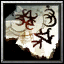 | **[不穩定卷軸](#esaz)**<br><sub>Нестабильный свиток</sub> | **能力：**有 50% 機率完成「任務」類道具的任務。若失敗則摧毀該道具。 |
| 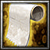 | **[強化卷軸](#flag)**<br><sub>Свиток усиления</sub> | **能力：**將「稀有」品質的道具提升到「獨特」品質。 |
| 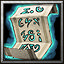 | **[淬火卷軸](#ofir)**<br><sub>Свиток закаливания</sub> | **能力：**將「附加」類道具強化為「淬鍊」類。 |
|  | **[覺醒卷軸](#pclr)**<br><sub>Свиток пробуждения</sub> | **能力：**將「獨特」品質的道具提升到「傳說」品質。 |
|  | **[扭曲卷軸](#plcl)**<br><sub>Свиток искажения</sub> | **能力：**將「獨特」品質的道具轉換為隨機的「扭曲」類道具。可對扭曲道具使用以更換為另一件扭曲道具。 |
| 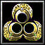 | **[寶石轉化器](#rhe3)**<br><sub>Преобразователь самоцветов</sub> | **能力：**可將三顆相同的寶石合成為一顆純淨寶石。 |
| 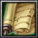 | **[轉化卷軸](#sksh)**<br><sub>Свиток преобразования</sub> | **能力：**將「普通」品質的道具轉變為一件隨機道具。<br>**機率：**機率：50% 稀有、25% 特殊（lv.2）、15% 特殊（lv.3）、10% 獨特。 |
| 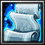 | **[折射卷軸](#tbsm)**<br><sub>Свиток преломления</sub> | **能力：**將「聖物」類道具轉換為隨機的「折射」類道具。可對折射道具使用以更換為另一件折射道具。每種聖物各自對應一組折射道具。 |

### 品質階梯（升級卷軸 → 強化卷軸 → 覺醒卷軸）

11 條掉落裝備線，各自從「普通」一路升到「傳說」。傳說裝備是多條神器配方的必要素材。

| 普通 | → 升級卷軸 → 稀有 | → 強化卷軸 → 獨特 | → 覺醒卷軸 → 傳說 |
|---|---|---|---|
| 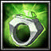 [敏捷戒指](#i00c) |  [強力敏捷戒指](#ratc) |  [完美敏捷戒指](#belv) |  [狩獵女神之戒](#stel) |
| 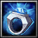 [智力戒指](#i001) | 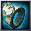 [強力智力戒指](#rat6) | 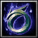 [完美智力戒指](#rde1) |  [規律女神之戒](#lhst) |
|  [力量戒指](#i005) |  [強力力量戒指](#rat9) | 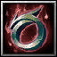 [完美力量戒指](#rde2) | 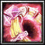 [大力神之戒](#bgst) |
| 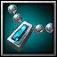 [粗糙項鍊](#i018) | 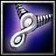 [魔法項鍊](#ward) | 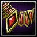 [咒術師項鍊](#rwiz) | 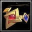 [大魔導師項鍊](#rst1) |
| 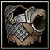 [簡易盔甲](#i01n) | 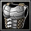 [板甲](#penr) | 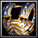 [衛兵鎧甲](#rlif) | 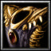 [冠軍鎧甲](#clsd) |
| 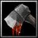 [簡易斧頭](#i00k) | 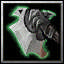 [鋸齒斧](#spsh) | 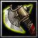 [衛兵戰斧](#rde3) | 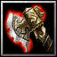 [冠軍之斧](#bspd) |
|  [粗糙盾牌](#i00u) | 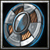 [堅固盾牌](#cnob) | 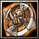 [老兵之盾](#ciri) | 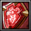 [冠軍之盾](#evtl) |
| 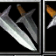 [簡易短刀](#i01i) | 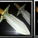 [磨利短刀](#pmna) | 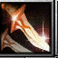 [祕銀短刀](#rin1) | 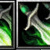 [惡魔短刀](#gcel) |
|  [普通手套](#i02j) | 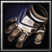 [強化手套](#dsum) | 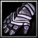 [衛兵手套](#sbch) |  [冠軍手套](#brac) |
|  [普通靴子](#i013) | 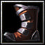 [士兵之靴](#rhth) | 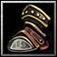 [衛兵之靴](#mcou) | 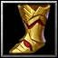 [完美之靴](#ssil) |
| 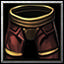 [平紋褲](#i01t) | 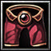 [侍僧之褲](#hcun) | 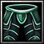 [術士之褲](#clfm) |  [大法師之褲](#odef) |

## 四、合成表（40 條）

資料來自 `synthesis.xlsx`；產物的屬性與能力已換成地圖檔的最新數值。

> **神器的持有限制**：每件神器只能合成一次，所以預設每件只會有 1 個。
> 例外是鐵匠 —— 鐵匠可以複製神器，但整場只能用一次，而且只能挑其中一件，
> 所以一套配裝裡「最多有一件神器出現兩次」，其餘神器仍然各一件。
> （此規則由玩家提供，地圖資料未記錄。）

符號：`+` 材料相加、`=` 合成結果、`→` 完成任務後變成、`←` 對左邊的裝備使用右邊的卷軸。

> 另有兩條配方不在這張表裡（xlsx 沒收錄），只列在第九節的個別裝備上：
> **黃道十二宮** ＝ 潛能覺醒 ＋ 覺醒卷軸（玩家提供，Wiki 寫錯）；
> **寒冰之球** ＝ 熔岩球 ＋ 石英法杖（玩家提供，與簡體版更新情報一致）。

> 另有一條配方已依新版更正：**矛與盾**的第三個素材由「石英法杖」改為「翡翠吊墜」
>（玩家提供，與簡體版更新情報「矛盾体不再需要石英法杖，改用翡翠吊墜」一致）。

| # | 合成路線 | 產物 | 產物屬性 |
|---:|---|---|---|
| 1 |  [黑暗容器](#ratf) `+`  [邪教戒指](#gsou) `+` 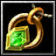 [翡翠吊墜](#rej2) `=` |  **矛與盾**<br><sub>神器（lv.2）</sub> | +10主屬性，+50技能強度<br>**MOD：**使用技能對附近 7 名隨機敵人造成（40% 全屬性）點傷害。 |
| 2 |  [儀式聖杯](#dust) `+`  [轉化卷軸](#sksh) `=` |  **黑暗容器**<br><sub>神器（lv.1）</sub> | **能力：**英雄受到的傷害增加 25%，對敵人造成的傷害增加 25%。對狀態無效。 |
| 3 |  [法師之戒](#rump) `+`  [轉化卷軸](#sksh) `=` |  **邪教戒指**<br><sub>神器（lv.1）</sub> | +7主屬性<br>**MOD：**使用技能對附近 3 名隨機敵人造成（40% 總屬性）點傷害。 |
| 4 | 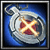 [十字軍的護符](#scul) `+`  [轉化卷軸](#sksh) `=` | 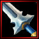 **十字軍之刃**<br><sub>神器（lv.1）</sub> | +15%對亡靈攻擊與技能傷害，+15%對亡靈攻擊與技能防禦 |
| 5 |  [奶酪](#tgxp) `+`  [奶酪](#tgxp) `+`  [奶酪](#tgxp) `=` |  **大奶酪**<br><sub>神器（lv.1）</sub> | +5生命回復，+5法力回復<br>**倍增：**提升生命與法力上限 20%。效果自動刷新。 |
| 6 | 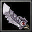 [掠奪者之劍](#mlst) `+` 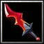 [儀式匕首](#frhg) `+` 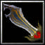 [亡者之劍](#nspi) `=` | 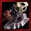 **分離者**<br><sub>神器（lv.1）</sub> | +12攻擊力<br>**MOD：**擊殺敵人為英雄回復 15 點生命值，並強化下一次攻擊，額外造成 75 點魔法傷害。 |
| 7 |  [分離者](#ajen) `+`  [鍍金匕首](#i04e) `+` 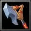 [利斧](#i08f) `=` | 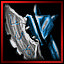 **判官**<br><sub>神器（lv.3）</sub> | +35攻擊力，+35%對英雄傷害<br>**MOD：**擊殺敵人為英雄回復 18 點生命值，並強化下一次攻擊（+100 魔法傷害）。 |
| 8 | 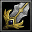 [鷹之匕首](#i04w) `+`  [五行吊墜](#frgd) `=` | 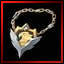 **黑鷹吊墜**<br><sub>神器（lv.1）</sub> | +3護甲，+10攻擊力，抵抗詛咒<br>**能力：**攻擊有 40% 機率造成 1.3 倍傷害。<br>**MOD：**攻擊回復 6 點生命值。冷卻 1 秒。 |
| 9 |  [智力吊墜](#i075) `+`  [力量吊墜](#i073) `+`  [敏捷吊墜](#i074) `=` |  **朱砂護符**<br><sub>神器（lv.2）</sub> | **倍增：**提升英雄屬性 25%。效果自動刷新。 |
| 10 |  [朱砂護符](#ckng) `+`  [黑鷹吊墜](#afac) `=` |  **優雅吊墜**<br><sub>神器（lv.3）</sub> | +10攻擊力，+3護甲，抵抗詛咒<br>**能力：**攻擊有 40% 機率造成 1.3 倍傷害。<br>**MOD：**攻擊回復 6 點生命值。冷卻 1 秒。<br>**倍增：**提升英雄屬性 33%。 |
| 11 |  [陳舊甲殼](#i00x) `+`  [角鬥士頭盔](#i05h) `+`  [生鏽頭盔](#rnsp) `=` |  **封閉心智頭盔**<br><sub>神器（lv.2）</sub> | +20%對近戰單位防禦，+20%對英雄防禦，抵抗點燃<br>**能力：**來自智力的法力回復加成轉為生命回復加成。效果自動刷新。 |
| 12 |  [守護之矛](#i039) `→`  [穿刺長矛](#i03d) `+`  [不穩定卷軸](#esaz) `=` |  **歌寂神兵**<br><sub>神器（lv.2）</sub> | +20攻擊力，+5全屬性，+5穿透<br>**能力：**每擊殺一名敵方英雄，生命上限提升 100 點。 |
| 13 |  [魔法寶珠](#soul) `+`  [淬火卷軸](#ofir) `=`  [潛能覺醒](#schl) `+`  [覺醒卷軸](#pclr) `=` |  **黃道十二宮**<br><sub>神器（lv.2）</sub> | +3法力回復，+10智力，+125技能強度<br>**能力：**完成可強化道具的任務時給予雙倍效果（不可疊加）。可用於扭曲道具。 |
| 14 |  [知善惡果](#i053) `+`  [鹹魚傑作](#i042) `=` |  **惡魔果實**<br><sub>神器（lv.2）</sub> | +25生命回復，+10法力回復，+75%疾病抗性<br>**能力：**生命值 75% 以上時，受到的攻擊與技能傷害提升 100%。 |
| 15 |  [無底瓶](#i00i) `→`  [瓊漿玉液](#i00t) `+`  [不穩定卷軸](#esaz) `=` |  **聖女之血**<br><sub>神器（lv.3）</sub> | +3全屬性<br>**能力：**使用時回復 13% 生命值與 13% 法力值。 |
| 16 |  [熔岩球](#i04g) `+`  [熔岩之劍](#hslv) `=` |  **烈焰法杖**<br><sub>神器（lv.3）</sub> | +20智力，+20攻擊力，+3生命回復<br>**MOD：**使用技能後，英雄的下一次攻擊釋放 7 個簇狀體，對範圍造成（30 + 10% 智力）點傷害，並有 50% 機率點燃（最終傷害 100%）。 |
| 17 |  [平紋褲](#i01t) `←`  [升級卷軸](#blba) `←`  [強化卷軸](#flag) `←`  [覺醒卷軸](#pclr) `←`  [強化卷軸](#flag) `=` |  **大法師長袍**<br><sub>神器（lv.3）</sub> | +6護甲，+300技能強度<br>**能力：**使用技能使生命與法力回復各提升 2 點，持續 10 秒，最多疊加 5 層。 |
| 18 |  [扭曲卷軸](#plcl) `+`  [扭曲卷軸](#plcl) `=` |  **諾伊斗篷**<br><sub>神器（lv.2）</sub> | +5護甲，+1.5法力回復，+15智力，+100技能強度 |
| 19 |  [折射卷軸](#tbsm) `+`  [折射卷軸](#tbsm) `=` |  **超凡護符**<br><sub>神器（lv.3）</sub> | 抵抗點燃與易燃，抵抗流血，抵抗冰凍，抵抗詛咒<br>**能力：**每 60 秒完全回復英雄的法力。 |
| 20 |  [粗糙盾牌](#i00u) `←`  [升級卷軸](#blba) `←`  [強化卷軸](#flag) `←`  [覺醒卷軸](#pclr) `←`  [折射卷軸](#tbsm) `=` |  **野獸之盾**<br><sub>神器（lv.3）</sub> | +10護甲，+20力量，+3生命回復，+20反傷，抵抗流血<br>**能力：**每次受到傷害回復 2 點生命值。受到的疾病效果在判定機率前轉為流血。無法獲得點燃與易燃抗性。 |
| 21 |  [刺刀](#rej4) `+`  [刺客之刺](#i05z) `+`  [黑曜石](#i06s) `+`  [干將](#phea) `=` |  **撕裂末日**<br><sub>神器（lv.4）</sub> | +40攻擊力，+30%攻擊速度，+15力量，+15敏捷<br>**能力：**賦予近戰攻擊濺射效果（大範圍 22%）。<br>**MOD：**攻擊造成 75 點魔法傷害，並以 100% 機率施加易傷。冷卻 2 秒。 |
| 22 |  [念珠](#rej5) `+`  [檢察官的斗篷](#i08w) `+`  [歌寂神兵](#rde4) `+`  [十字軍之刃](#shar) `=` |  **復仇之手**<br><sub>神器（lv.4）</sub> | +20攻擊力，+15%對亡靈傷害，+15%對亡靈防禦，+30技能強度，+15穿透，+10%裝備技能威力<br>**能力：**穿透效果對英雄以 150% 效力生效。每擊殺一名敵方英雄，生命上限提升 125 點。 |
| 23 |  [喬木之斧](#lnrn) `+`  [怒火戰斧](#i08k) `+`  [風暴護身符](#sora) `=` |  **雷霆戰斧**<br><sub>神器（lv.4）</sub> | +25攻擊力，+20力量，+3生命回復<br>**MOD：**攻擊觸發連鎖閃電（8 個目標），造成 100 點傷害。若目標為英雄或 8 級以上單位，傷害提升 125%。冷卻 4 秒。 |
| 24 |  [構造之球](#i08v) `+`  [最後通牒](#i007) `=` |  **大法師權杖**<br><sub>神器（lv.4）</sub> | +15智力，+3法力回復，+200技能強度，+25%對英雄攻擊與技能傷害，+25%裝備技能威力<br>**能力：**每 0.75 秒對附近隨機敵人造成 125 點傷害。 |
| 25 |  [吸血骨鈴](#i06u) `+`  [失重毒刺](#i092) `=` |  **災妄之星**<br><sub>神器（lv.4）</sub> | +30攻擊力，+15敏捷，25%吸血<br>**MOD：**攻擊造成 100 點魔法傷害，100% 機率造成流血（最終傷害 100 點），30% 機率施加虛弱。冷卻 3 秒。 |
| 26 |  [雄獅鎧甲](#pman) `+`  [先鋒之凱鎧](#i077) `=` |  **帝王鎧甲**<br><sub>神器（lv.4）</sub> | +1500生命值，+20力量，+5護甲，+8生命回復<br>**能力：**生命值 70% 以上的敵人對英雄造成的攻擊、技能與狀態傷害降低 25%。 |
| 27 |  [金色王冠](#rnec) `+`  [均衡之印](#i008) `=` |  **生命之冠**<br><sub>神器（lv.4）</sub> | +18全屬性，+5護甲，+175技能強度<br>**能力：**每秒為英雄回復 1% 生命與法力。 |
| 28 |  [龍之守衛](#vamp) `+`  [法力催化劑](#i06w) `=` |  **永恆之夢**<br><sub>神器（lv.4）</sub> | +7護甲，+20智力，+5生命回復，抵抗冰凍<br>**MOD：**使用技能賦予 40 點護甲，持續 3.5 秒（效果可疊加）。 |
| 29 |  [智力戒指](#i001) `←`  [升級卷軸](#blba) `←`  [強化卷軸](#flag) `←`  [覺醒卷軸](#pclr) `=` |  **規律女神之戒**<br><sub>傳說</sub> | +30智力，+4.5法力回復，+9%非狀態造成傷害 |
| 30 |  [粗糙項鍊](#i018) `←`  [升級卷軸](#blba) `←`  [強化卷軸](#flag) `←`  [覺醒卷軸](#pclr) `=` |  **大魔導師項鍊**<br><sub>傳說</sub> | +500法力值，+5法力回復，+100技能強度 |
| 31 |  [規律女神之戒](#lhst) `+`  [大魔導師項鍊](#rst1) `+`  [女巫帽](#i04f) `+`  [零時迷子](#i086) `=` |  **水晶項鍊**<br><sub>神器（lv.5）</sub> | +40智力，+800法力值，+8法力回復，+175技能強度，+11%攻擊與技能造成傷害 |
| 32 |  [巨人頭盔](#wneu) `+`  [重盾](#i072) `+`  [庇護者](#wlsd) `+`  [防禦堡壘](#i07k) `=` |  **王國宙斯盾**<br><sub>神器（lv.5）</sub> | +2000生命值，+20護甲<br>**能力：**散發 +8 護甲光環，並有 50% 機率格擋 200 點物理傷害（最低傷害 10 點）。 |
| 33 |  [敏捷戒指](#i00c) `←`  [升級卷軸](#blba) `←`  [強化卷軸](#flag) `←`  [覺醒卷軸](#pclr) `=` |  **狩獵女神之戒**<br><sub>傳說</sub> | +30敏捷，+15攻擊力，+15穿透 |
| 34 |  [普通手套](#i02j) `←`  [升級卷軸](#blba) `←`  [強化卷軸](#flag) `←`  [覺醒卷軸](#pclr) `=` |  **冠軍手套**<br><sub>傳說</sub> | +8護甲，+15敏捷，+30%攻擊速度<br>**MOD：**英雄的攻擊對敵人額外造成（250% 敏捷）魔法傷害。冷卻 4 秒。 |
| 35 |  [狩獵女神之戒](#stel) `+`  [冠軍手套](#brac) `+`  [骨甲](#i04x) `+`  [血污](#i05u) `=` |  **鋼鐵奉獻**<br><sub>神器（lv.5）</sub> | +40敏捷，+600生命值，+30%對0-1級敵人防禦，+11穿透<br>**MOD：**每 4 秒，英雄對敵人造成（300% 敏捷）點反傷，並有 50% 機率暈眩 4 秒。 |
| 36 |  [夙願](#i07d) `+`  [爆裂之刃](#skul) `+`  [熾天使長矛](#ankh) `+`  [迷霧之矛](#i04c) `=` |  **月光寶劍**<br><sub>神器（lv.5）</sub> | +20敏捷，+30攻擊力，30%機率造成2.5倍暴擊，+125技能強度<br>**MOD：**每 15 秒，英雄的攻擊對範圍造成（200 + 40% 技能強度）點傷害。生命值偏低時加速冷卻（每損失 10% 生命 -1 秒）。 |
| 37 |  [水晶法杖](#i06x) `+`  [輝煌法杖](#sman) `+`  [魔法金湯](#woms) `+`  [太陽之書](#i0av) `=` |  **獅子星座**<br><sub>神器（lv.5）</sub> | +30智力，+6法力回復，+10護甲，+200技能強度<br>**MOD：**使用技能淨化英雄身上的負面效果與狀態，回復 20 點生命與 30 點法力，並有 25% 機率對英雄周圍範圍造成（200 + 50% 技能強度）點傷害。 |
| 38 |  [力量戒指](#i005) `←`  [升級卷軸](#blba) `←`  [強化卷軸](#flag) `←`  [覺醒卷軸](#pclr) `=` |  **大力神之戒**<br><sub>傳說</sub> | +30力量，+6生命回復，+18%對非英雄單位非狀態傷害 |
| 39 |  [簡易盔甲](#i01n) `←`  [升級卷軸](#blba) `←`  [強化卷軸](#flag) `←`  [覺醒卷軸](#pclr) `=` |  **冠軍鎧甲**<br><sub>傳說</sub> | +8護甲，+15力量，+15%對英雄攻擊與技能防禦<br>**MOD：**每 4 秒，英雄對攻擊自己的敵人造成（250% 力量）點傷害。 |
| 40 |  [大力神之戒](#bgst) `+`  [冠軍鎧甲](#clsd) `+`  [玄鐵手套](#i05c) `+`  [血之護腕](#i085) `=` |  **泰坦神拳**<br><sub>神器（lv.5）</sub> | +40力量，+50攻擊力，+25%對0-1級敵人攻擊與技能傷害<br>**MOD：**攻擊對範圍造成（250% 力量）點魔法傷害，並有 50% 機率暈眩 2 秒。冷卻 10 秒。 |

> 第 17、20、29、30、33、34、38、39 條是把「卷軸階梯」整條展開，
> 等同於「傳說裝備 ＋ 最後一張卷軸」。

## 五、扭曲裝備循環（29 件）

對「獨特」品質裝備使用 **扭曲卷軸** 會轉成一件扭曲裝備；
對扭曲裝備再次使用扭曲卷軸則**按固定順序**換成下一件，走完一圈回到起點。

| 順序 | 圖示 | 裝備 | 屬性 | 能力 |
|---:|:---:|---|---|---|
| 1 |  | **[扭曲權杖](#shea)**<br><sub>Скипетр разлома</sub> | +325法力值，+175技能強度 | **能力：**使用技能使技能強度提升 25，持續 15 秒，最多疊加 15 層。疊滿 15 層時清空加成，並對附近 15 名敵人造成（75% 最大法力）點傷害。 |
| 2 |  | **[神秘之戒](#pinv)**<br><sub>Мистическое кольцо</sub> | +600生命值，+600法力值 | **能力：**使用時交換英雄當前的生命值與法力值，並各回復 10%。 |
| 3 |  | **[帝王之劍](#spro)**<br><sub>Меч Императора</sub> | — | **能力：**英雄攻擊力提升 80%（光環效果，不可疊加）。 |
| 4 |  | **[榮譽頭盔](#ssan)**<br><sub>Шлем чести</sub> | +10力量，+300生命值，+5護甲，-10%裝備技能冷卻，+20%對英雄非狀態傷害減免，抵抗流血 | — |
| 5 |  | **[爆裂之刃](#skul)**<br><sub>Кацбальгер</sub> | +10攻擊力，+10敏捷，+5穿透 | **能力：**攻擊有 30% 機率造成 2 倍傷害。 |
| 6 |  | **[雄獅鎧甲](#pman)**<br><sub>Львиный панцирь</sub> | +5護甲，+675生命值，+5生命回復 | **能力：**生命值 75% 以上的敵人對英雄造成的攻擊、技能與狀態傷害降低 18%。 |
| 7 |  | **[金色王冠](#rnec)**<br><sub>Золотая диадема</sub> | — | **能力：**使力量、敏捷與智力提升等同於英雄等級的數值。效果自動刷新，非倍增效果。 |
| 8 |  | **[爆裂十字弩](#wneg)**<br><sub>Арбалет-болтер</sub> | +15攻擊力，+9穿透，+50技能強度 | **能力：**使用時以加重弩箭擊中目標，造成（200 + 75% 技能強度）點魔法傷害，並暈眩目標 5 秒（英雄 2 秒）。 |
| 9 |  | **[紅寶石權杖](#silk)**<br><sub>Рубиновый жезл</sub> | +12智力，+3.5法力回復，+175生命值 | **能力：**若英雄點燃失敗，則對該目標以 35% 機率施加易燃效果。 |
| 10 |  | **[專注之戒](#shas)**<br><sub>Кольцо концентрации</sub> | +10智力，+350法力值，+5護甲 | **能力：**生命值 75% 以上時，額外提升 5 點/秒法力回復。 |
| 11 |  | **[黑暗水晶](#moon)**<br><sub>Кристалл тьмы</sub> | +25力量，+10敏捷 | **倍增：**依公式提升攻擊速度：2 點力量 = 1% 攻擊速度。效果自動刷新。 |
| 12 |  | **[暗影之刃](#sneg)**<br><sub>Теневое лезвие</sub> | +100攻擊力，+25%攻擊速度，+15敏捷，+50%受到英雄非狀態受到傷害 | — |
| 13 |  | **[禁忌契約](#tsct)**<br><sub>Запретный трактат</sub> | +250法力值，+2.25法力回復 | **能力：**使用時召喚 4 隻地獄爪牙，持續 30 秒。每次使用，獵犬會變得更強大。 |
| 14 |  | **[輝煌法杖](#sman)**<br><sub>Сияющий посох</sub> | +12智力，+2.5法力回復，+75技能強度 | **能力：**使用技能淨化英雄身上的負面效果與狀態。 |
| 15 |  | **[龍之守衛](#vamp)**<br><sub>Драконий оберег</sub> | +6護甲，+300生命值，+6生命回復，+50技能強度，抵抗詛咒 | — |
| 16 |  | **[干將](#phea)**<br><sub>Меч-кладенец</sub> | +15攻擊力，+10力量 | **能力：**英雄的近戰攻擊具有 40% 濺射效果，範圍 150。 |
| 17 |  | **[黑暗人參](#sreg)**<br><sub>Густая Тьма</sub> | +1000生命值 | **能力：**受到的傷害增加 25%。對英雄造成的傷害增加 50%。對狀態無效。 |
| 18 |  | **[巨人頭盔](#wneu)**<br><sub>Шлем исполина</sub> | +500生命值，+15力量 | **能力：**格擋 20 點受到的物理傷害，最低通過傷害為 4 點。 |
| 19 |  | **[熔岩之劍](#hslv)**<br><sub>Лавовый меч</sub> | +20智力，+20攻擊力 | **MOD：**使用技能後，英雄的下一次攻擊釋放 3 個簇狀體，對範圍造成（30 + 10% 智力）點傷害，並有 50% 機率點燃（最終傷害 100%）。 |
| 20 |  | **[魔法齒輪](#tcas)**<br><sub>Волшебная шестеренка</sub> | +2全屬性，+275生命值，+175法力值，+50技能強度 | **能力：**修復英雄附近（範圍 375）建築與機械單位的耐久，速度為 5 點/秒。 |
| 21 |  | **[傳送權杖](#mcri)**<br><sub>Изящный посох</sub> | +20智力，+135技能強度 | **能力：**立即將英雄傳送至指定的友方單位。冷卻 25 秒。 |
| 22 |  | **[追夢者](#tret)**<br><sub>Ловец снов</sub> | +10智力，+375生命值，+225法力值，+2護甲，+1法力回復，-10%復活時間 | **能力：**英雄總是以滿法力復活。敵方英雄死亡（無論由誰擊殺）會使裝備技能冷卻降低 20%，並在 60 秒內提升 100 點技能強度。 |
| 23 |  | **[追暮之弓](#stwp)**<br><sub>Лук сумеречного преследователя</sub> | +15攻擊力，+20%攻擊速度，+10敏捷，+5穿透 | **能力：**使用時將 250% 敏捷加入技能強度，持續 10 秒。 |
| 24 |  | **[冥界之盾](#pnvl)**<br><sub>Щит загробника</sub> | +10護甲，+15力量，+40反傷，+10%復活時間 | **能力：**敵方亡靈對英雄造成的攻擊與技能傷害降低 25%。 |
| 25 |  | **[間隔爍石](#tgrh)**<br><sub>Интервальный гравий</sub> | +444生命值，+444法力值，+44技能強度 | **能力：**每 5 秒隨機回復 4% 生命值或 4% 法力值。 |
| 26 |  | **[魔術師的面具](#sor1)**<br><sub>Маска фокусника</sub> | +3法力回復，+3護甲，+80%裝備技能威力 | **能力：**50% 的裝備技能威力會轉為狀態傷害加成。 |
| 27 |  | **[奧術精華](#pgin)**<br><sub>Эссенция арканы</sub> | +500法力值，+175技能強度 | **能力：**使用時鎖定當前法力值 10 秒。 |
| 28 |  | **[荊棘戒指](#fwss)**<br><sub>Кольцо шипов</sub> | +600生命值，+6生命回復，+60%反傷加成，+60%流血傷害 | — |
| 29 |  | **[血獵狼爪](#shdt)**<br><sub>Коготь волкодава</sub> | +30攻擊力，+10敏捷 | **能力：**流血機率與其傷害，每提升一個敵人等級增加 5%。 |

> 第 29 件（爆裂十字弩）之後回到第 1 件（紅寶石權杖）。

## 六、任務物品 → 聖物 → 折射 → 完美

地精商店的 4 件任務物品各自有一條專屬升級鏈：

```
任務物品(1階) --完成任務--> 任務物品(2階) --完成任務--> 聖物
                                                    │
                          折射卷軸 ─────────────────┤
                          （4 件循環，可重複重骰）    │
                                                    │
                          鐵匠技能 ─────────────────┘
                          （產出完美裝備）
```

**分岔點在聖物**：折射與完美是聖物的兩條分支，完美不是折射的下一階。

※「不穩定卷軸」有 50% 機率直接完成任務，失敗則摧毀該物品。

### 無底瓶線

| 階段 | 圖示 | 裝備 | 屬性 / 能力 |
|---|:---:|---|---|
| 任務物品 1 階 |  | **[無底瓶](#i00i)**<br><sub>Бездонная фляга</sub> | **能力：**使用時回復 75 點生命與 30 點法力。<br>**任務：**使用水壺或藥水 15 次以升級此道具。 |
| 任務物品 2 階 |  | **[治療之瓶](#i00j)**<br><sub>Сосуд исцеления</sub> | +1生命回復，+0.5法力回復<br>**能力：**使用時回復 150 點生命與 60 點法力。<br>**任務：**使用水壺或藥水 30 次以升級此道具。 |
| 聖物 |  | **[瓊漿玉液](#i00t)**<br><sub>Амброзия</sub> | +2.5生命回復，+1.25法力回復<br>**能力：**使用時回復 250 點生命與 100 點法力。 |
| 折射 1/4 |  | **[魔法金湯](#woms)**<br><sub>Магический тоник</sub> | +300法力值，+5護甲，+125技能強度<br>**能力：**使用後於 10 秒內回復 325 點生命值與 325 點法力值。 |
| 折射 2/4 |  | **[魔法小瓶](#mnst)**<br><sub>Пустой сосуд</sub> | +275生命值，+275法力值，+5護甲，+150技能強度<br>**MOD：**擊殺敵人為英雄回復 20 點生命值與 8 點法力。 |
| 折射 3/4 |  | **[靈丹妙藥](#whwd)**<br><sub>Панацея</sub> | +350生命值，+5生命回復，+25%裝備技能威力<br>**能力：**使用時完全回復生命與法力，並移除英雄身上的所有負面效果。冷卻 90 秒。 |
| 折射 4/4 |  | **[湛藍精華](#fgsk)**<br><sub>Лазурный ихор</sub> | +450生命值，+3法力回復，+5全屬性<br>**能力：**使用時技能強度提升 400，非狀態傷害減免提升 15%，持續 15 秒。 |
| **完美**<br><sub>聖物＋鐵匠技能</sub> |  | **[返老還童藥劑](#pams)**<br><sub>Омолаживающая вытяжка</sub> | +5生命回復，+2.5法力回復<br>**能力：**使用時回復 400 點生命與 200 點法力。 |

### 詛咒之盾線

| 階段 | 圖示 | 裝備 | 屬性 / 能力 |
|---|:---:|---|---|
| 任務物品 1 階 |  | **[詛咒之盾](#i026)**<br><sub>Боевой щит</sub> | +2護甲，+16反傷<br>**任務：**造成反傷 500 次以升級此道具。 |
| 任務物品 2 階 |  | **[掠奪者之盾](#i027)**<br><sub>Щит разорителя</sub> | +4護甲，+24反傷，+10%反傷加成<br>**任務：**造成反傷 1000 次以升級此道具。 |
| 聖物 |  | **[不詳之盾](#i029)**<br><sub>Зловещий щит</sub> | +6護甲，+40反傷，+15%反傷加成 |
| 折射 1/4 |  | **[鋼鐵守護者](#wshs)**<br><sub>Железный страж</sub> | +10護甲，+1000生命值，+150技能強度<br>**能力：**啟動時屬性加倍，但每秒消耗 1% 法力，可手動關閉。 |
| 折射 2/4 |  | **[深淵之盾](#wcyc)**<br><sub>Щит глубин</sub> | +5護甲，+5生命回復，+20力量<br>**MOD：**每 6 秒，對攻擊英雄的敵人釋放一道衝擊波，造成 100 +（35% 力量）點傷害。 |
| 折射 3/4 |  | **[痛苦之鏡](#will)**<br><sub>Зеркало мучений</sub> | +8護甲，+300生命值，+1.5法力回復，抵抗詛咒<br>**能力：**受到的非狀態傷害降低 10%，並將該傷害轉換為英雄的法力。 |
| 折射 4/4 |  | **[庇護者](#wlsd)**<br><sub>Заступник</sub> | +20力量，+750生命值<br>**能力：**散發光環，使友軍護甲提升 8 點。 |
| **完美**<br><sub>聖物＋鐵匠技能</sub> |  | **[復仇之盾](#nflg)**<br><sub>Щит возмездия</sub> | +10護甲，+50反傷，+75%反傷加成 |

### 守護之矛線

| 階段 | 圖示 | 裝備 | 屬性 / 能力 |
|---|:---:|---|---|
| 任務物品 1 階 |  | **[守護之矛](#i039)**<br><sub>Копьё стража</sub> | +4穿透<br>**MOD：**英雄攻擊回復 4 點法力。冷卻 1 秒。<br>**任務：**擊殺 15 名 3 級以上敵人以升級此道具。 |
| 任務物品 2 階 |  | **[符文長矛](#i03c)**<br><sub>Рунное копьё</sub> | +6穿透，+8%攻擊速度<br>**MOD：**英雄攻擊回復 6 點法力。冷卻 1 秒。<br>**任務：**擊殺 30 名 3 級以上敵人以升級此道具。 |
| 聖物 |  | **[穿刺長矛](#i03d)**<br><sub>Разящее копьё</sub> | +10穿透，+16%攻擊速度<br>**MOD：**英雄攻擊回復 8 點法力與 8 點生命值。冷卻 1 秒。 |
| 折射 1/4 |  | **[泰坦的復仇](#pomn)**<br><sub>Возмездие титана</sub> | +5智力，+30攻擊力，+25%攻擊速度，+10穿透<br>**能力：**擊殺敵人使英雄全屬性提升 1 點，持續 6 秒。 |
| 折射 2/4 |  | **[銀器](#hlst)**<br><sub>Сильвер</sub> | +20攻擊力，+20%攻擊速度，+12穿透<br>**能力：**生命值 75% 以上的敵人受到的非狀態傷害提升 100%。敵人處於冰凍狀態時，生命值判定門檻降至 50%。 |
| 折射 3/4 |  | **[熾天使長矛](#ankh)**<br><sub>Копье серафима</sub> | +20攻擊力，+20穿透，+100技能強度<br>**MOD：**每 15 秒，英雄的攻擊對範圍造成（150 + 30% 技能強度）點傷害。 |
| 折射 4/4 |  | **[巫師之災](#infs)**<br><sub>Бич чародеев</sub> | +10敏捷，+25攻擊力，+15穿透，+50技能強度<br>**MOD：**攻擊對敵人施加流血，最終傷害為（150 + 35% 技能強度）點，流血機率等於目標當前法力的百分比。冷卻 2 秒。 |
| **完美**<br><sub>聖物＋鐵匠技能</sub> |  | **[隕星長矛](#stpg)**<br><sub>Метеоритное копьё</sub> | +20穿透，+25%攻擊速度<br>**MOD：**英雄攻擊回復 10 點法力與生命值，並以 100% 機率施加虛弱。冷卻 1 秒。 |

### 戰錘線

| 階段 | 圖示 | 裝備 | 屬性 / 能力 |
|---|:---:|---|---|
| 任務物品 1 階 |  | **[戰錘](#i00z)**<br><sub>Боевой молот</sub> | +10%對英雄傷害<br>**能力：**攻擊有 14% 機率額外造成 50 點傷害並暈眩目標 3 秒（英雄 1 秒）。<br>**任務：**擊殺 1 名敵方英雄以升級此道具。 |
| 任務物品 2 階 |  | **[灌鉛戰錘](#i010)**<br><sub>Освинцованный молот</sub> | +15%對英雄傷害，+10攻擊力<br>**能力：**攻擊有 18% 機率額外造成 75 點傷害並暈眩目標 3 秒（英雄 0.9 秒）。<br>**任務：**擊殺 3 名敵方英雄以升級此道具。 |
| 聖物 |  | **[信仰之錘](#i028)**<br><sub>Молот веры</sub> | +20%對英雄傷害，+15攻擊力，+200生命值<br>**能力：**攻擊有 22% 機率額外造成 100 點傷害並暈眩目標 3 秒（英雄 1 秒）。 |
| 折射 1/4 |  | **[碎界](#rej3)**<br><sub>Коллапс</sub> | +20攻擊力，+500生命值，+15%對近戰單位非狀態傷害<br>**能力：**電擊效果造成（125% 力量）點傷害。<br>**MOD：**攻擊對範圍造成 75 點傷害，並有 50% 機率對敵人施加電擊效果。冷卻 10 秒。 |
| 折射 2/4 |  | **[劊子手的救贖](#wild)**<br><sub>Искупление палача</sub> | +20攻擊力，+7全屬性<br>**能力：**擊殺敵方英雄或 6 級以上士兵可回復 6% 生命值，並使英雄攻擊力提升 50 點、護甲提升 7 點，持續 12 秒。 |
| 折射 3/4 |  | **[裂魂之刃](#fgrg)**<br><sub>Раскалыватель</sub> | +20攻擊力，+30%攻擊速度，+20穿透<br>**能力：**英雄的攻擊使敵人護甲降低等同於敵人等級的數值。對每個單位只作用 1 次；對英雄以 50% 效力生效。 |
| 折射 4/4 |  | **[毀滅之錘](#pnvu)**<br><sub>Молот разрушения</sub> | +25攻擊力，+15力量，+25穿透<br>**獨特能力：**攻擊敵方英雄會摧毀目標背包中 2 件隨機道具。此效果對每名敵方英雄只觸發 1 次。 |
| **完美**<br><sub>聖物＋鐵匠技能</sub> |  | **[科技之錘](#pspd)**<br><sub>Техномолот</sub> | +30%對英雄傷害，+30攻擊力，+400生命值<br>**能力：**攻擊有 26% 機率額外造成 150 點傷害並暈眩目標 3 秒（英雄 1 秒）。 |

> 「折射 → 完美」的對應由舊合成表流程圖 ＋ 品質分類推得，Wiki 與地圖物件資料都沒有記錄
> 這段配方，建議以遊戲內實測為準。

## 七、寶石與耳環

| 寶石 | ×3 → 純淨寶石 | ×2 → 耳環 | 耳環屬性 |
|---|---|---|---|
|  [紅寶石](#lmbr)（+15力量） |  [純淨紅寶石](#rma2)（+50力量） |  [紅寶石耳環](#i00p) | **+100力量** |
|  [藍寶石](#gfor)（+15智力） |  [純淨藍寶石](#sor3)（+50智力） |  [藍寶石耳環](#i00q) | **+100智力** |
|  [翡翠](#gomn)（+15敏捷） |  [純淨翡翠](#sor2)（+50敏捷） |  [翡翠耳環](#i00f) | **+100敏捷** |
|  [紫水晶](#tpow)（+125技能強度） |  [純淨紫水晶](#sor5)（+400技能強度） |  [星界耳環](#i00e) | **+800技能強度** |
|  [金蛋白石](#guvi)（+600生命值） |  [純淨蛋白石](#sor4)（+2000生命值） |  [黃金耳環](#i00o) | **+4000生命值** |

- 3 顆相同寶石 ＋ **寶石轉化器** → 1 顆純淨寶石
- 2 顆相同純淨寶石 ＋ **珠寶匠工具組** → 1 件耳環
- **耳環類道具全身只能攜帶 1 件。**

<a id="wikimiss"></a>

## 八、Wiki 未收錄的裝備

以下 6 件在地圖檔裡存在，但俄文 Wiki 沒有頁面：

| 圖示 | 名稱 | 品質 | 屬性 / 能力 |
|:---:|---|---|---|
|  | **[祕密寶盒](#i004)**<br><sub>Тайная шкатулка</sub> | 特殊（lv.5） | **能力：**生成一件隨機的「特殊 lv.2」道具放入圖鑑（F2）背包，賦予英雄該道具的加成且不佔用格子。寶盒類道具只能持有 1 件。使用後消失。 |
|  | **[寒冰長矛](#i006)**<br><sub>Ледяное копье</sub> | 特殊（lv.4） | +8敏捷，+8智力，+10穿透<br>**MOD：**攻擊造成 115 點魔法傷害，並以 100% 機率對敵人施加冰凍。冷卻 4 秒。 |
|  | **[寒冷之刃](#i00r)**<br><sub>Холодное лезвие</sub> | 特殊（lv.3） | +4敏捷，+4智力，+10攻擊力<br>**能力：**二次冰凍傷害增加 150 點。<br>**MOD：**攻擊有 50% 機率對敵人施加冰凍。冷卻 2 秒。 |
|  | **[寒冰之球](#i00s)**<br><sub>Сфера льда</sub> | 神器（lv.1） | **能力：**每 5 秒對附近敵人以 100% 機率施加冰凍。 處於「冰凍」狀態的目標受到的狀態傷害提升 35%。不影響二次冰凍的傷害（該傷害在冰凍解除後才結算）。 |
|  | **[靈魂護符](#i00y)**<br><sub>Амулет Души</sub> | 特殊（lv.5++） | +1250生命值，+500法力值，+25敏捷，+25智力，+50%狀態抗性<br>**能力：**成功對敵人施加負面狀態（冰凍除外）時，額外以 50% 機率施加冰凍。 |
|  | **[幽魂匕首](#i017)**<br><sub>Призрачный кинжал</sub> | 特殊（lv.5） | +20攻擊力，+100%裝備技能威力 |

## 九、裝備一覽（474 件）

「別名」為舊合成表使用的中文名，與本文譯名並列方便對照。🛒 為商店販售。

**快速跳轉：** [普通](#g0) · [稀有](#g1) · [獨特](#g2) · [傳說](#g3) · [特殊（lv.1）](#g4) · [特殊（lv.2）](#g5) · [特殊（lv.3）](#g6) · [特殊（lv.4）](#g7) · [特殊（lv.5）](#g8) · [特殊（lv.5+）](#g9) · [特殊（lv.5++）](#g10) · [神器（lv.1）](#g11) · [神器（lv.2）](#g12) · [神器（lv.3）](#g13) · [神器（lv.4）](#g14) · [神器（lv.5）](#g15) · [扭曲](#g16) · [任務物品（1/2）](#g17) · [任務物品（2/2）](#g18) · [聖物](#g19) · [折射](#g20) · [完美](#g21) · [附加](#g22) · [淬鍊](#g23) · [儀式](#g24) · [寶石](#g25) · [耳環](#g26) · [強化](#g27) · [符文](#g28) · [信使](#g29) · [新年](#g30) · [復活節](#g31) · [萬聖節](#g32) · [消耗品／掉落物](#g33)

<a id="g0"></a>

### 普通（11 件）

| 圖示 | 名稱 | 品質 | 屬性 | 能力 | 配方 / 去向 |
|:---:|---|---|---|---|---|
|  | <a id="i001"></a>**智力戒指**<br><sub>Кольцо разума</sub><br><sub>🛒 神祕藏寶室</sub> | 普通 | +5智力 | — | — |
|  | <a id="i005"></a>**力量戒指**<br><sub>Кольцо силы</sub><br><sub>🛒 神祕藏寶室</sub> | 普通 | +5力量 | — | — |
|  | <a id="i00c"></a>**敏捷戒指**<br><sub>Кольцо ловкости</sub><br><sub>🛒 神祕藏寶室</sub> | 普通 | +5敏捷 | — | — |
|  | <a id="i00k"></a>**簡易斧頭**<br><sub>Простой топор</sub> | 普通 | +8攻擊力 | — | — |
|  | <a id="i00u"></a>**粗糙盾牌**<br><sub>Простой щит</sub><br><sub>🛒 巫毒商店</sub> | 普通 | +3護甲，+4%狀態抗性 | — | — |
|  | <a id="i013"></a>**普通靴子**<br><sub>Простые сапоги</sub> | 普通 | +50移動速度，+10%狀態抗性 | — | — |
|  | <a id="i018"></a>**粗糙項鍊**<br><sub>Простое ожерелье</sub><br><sub>別名：粗糙项链</sub><br><sub>🛒 神祕藏寶室</sub> | 普通 | +100法力值，+15技能強度 | — | — |
|  | <a id="i01i"></a>**簡易短刀**<br><sub>Простые ножи</sub> | 普通 | +13%攻擊速度 | — | — |
|  | <a id="i01n"></a>**簡易盔甲**<br><sub>Простой доспех</sub><br><sub>別名：简易盔甲</sub><br><sub>🛒 巫毒商店</sub> | 普通 | +1護甲，+2力量 | **MOD：**每 4 秒，英雄對攻擊自己的敵人造成 40 點傷害。 | — |
|  | <a id="i01t"></a>**平紋褲**<br><sub>Простые штаны</sub><br><sub>別名：平纹裤</sub><br><sub>🛒 巫毒商店</sub> | 普通 | +1護甲，+2智力 | **MOD：**使用技能為英雄回復 25 點法力。冷卻 10 秒。 | — |
|  | <a id="i02j"></a>**普通手套**<br><sub>Простые перчатки</sub><br><sub>🛒 巫毒商店</sub> | 普通 | +1護甲，+2敏捷 | **MOD：**英雄的攻擊對敵人額外造成 40 點魔法傷害。冷卻 4 秒。 | **用於：**[無限手套](#lgdh) |

<a id="g1"></a>

### 稀有（11 件）

| 圖示 | 名稱 | 品質 | 屬性 | 能力 | 配方 / 去向 |
|:---:|---|---|---|---|---|
|  | <a id="cnob"></a>**堅固盾牌**<br><sub>Прочный щит</sub> | 稀有 | +5護甲，+125生命值，+5反傷，+6%狀態抗性 | — | — |
|  | <a id="dsum"></a>**強化手套**<br><sub>Укрепленные перчатки</sub> | 稀有 | +2護甲，+6敏捷 | **MOD：**英雄的攻擊對敵人額外造成 75 點魔法傷害。冷卻 4 秒。 | — |
|  | <a id="hcun"></a>**侍僧之褲**<br><sub>Штаны адепта</sub> | 稀有 | +2護甲，+6智力 | **MOD：**使用技能為英雄回復 40 點法力。冷卻 10 秒。 | — |
|  | <a id="penr"></a>**板甲**<br><sub>Латный доспех</sub> | 稀有 | +2護甲，+6力量 | **MOD：**每 4 秒，英雄對攻擊自己的敵人造成 70 點傷害。 | — |
|  | <a id="pmna"></a>**磨利短刀**<br><sub>Заточенные ножи</sub> | 稀有 | +25%攻擊速度，+8攻擊力 | — | — |
|  | <a id="rat6"></a>**強力智力戒指**<br><sub>Мощное кольцо разума</sub> | 稀有 | +10智力，+1.5法力回復 | — | — |
|  | <a id="rat9"></a>**強力力量戒指**<br><sub>Мощное кольцо силы</sub> | 稀有 | +10力量，+2生命回復 | — | — |
|  | <a id="ratc"></a>**強力敏捷戒指**<br><sub>Мощное кольцо ловкости</sub> | 稀有 | +10敏捷，+5攻擊力 | — | — |
|  | <a id="rhth"></a>**士兵之靴**<br><sub>Сапоги солдата</sub> | 稀有 | +70移動速度，+2全屬性，+15%狀態抗性 | — | — |
|  | <a id="spsh"></a>**鋸齒斧**<br><sub>Зазубренный топор</sub> | 稀有 | +16攻擊力 | **能力：**近戰攻擊具有 10% 濺射效果，範圍 150。 | — |
|  | <a id="ward"></a>**魔法項鍊**<br><sub>Магическое ожерелье</sub> | 稀有 | +200法力值，+1.25法力回復，+30技能強度 | — | — |

<a id="g2"></a>

### 獨特（11 件）

| 圖示 | 名稱 | 品質 | 屬性 | 能力 | 配方 / 去向 |
|:---:|---|---|---|---|---|
|  | <a id="belv"></a>**完美敏捷戒指**<br><sub>Безупречное кольцо ловкости</sub> | 獨特 | +20敏捷，+10攻擊力 | — | — |
|  | <a id="ciri"></a>**老兵之盾**<br><sub>Щит ветерана</sub> | 獨特 | +7護甲，+200生命值，+10反傷，+5%非狀態防禦，+8%狀態抗性 | — | — |
|  | <a id="clfm"></a>**術士之褲**<br><sub>Штаны чародея</sub> | 獨特 | +6護甲，+10智力，+50技能強度 | **MOD：**使用技能為英雄回復 60 點法力。冷卻 10 秒。 | — |
|  | <a id="mcou"></a>**衛兵之靴**<br><sub>Сапоги гвардейца</sub> | 獨特 | +90移動速度，+5全屬性，+20%狀態抗性 | — | — |
|  | <a id="rde1"></a>**完美智力戒指**<br><sub>Безупречное кольцо разума</sub> | 獨特 | +20智力，+3法力回復 | — | — |
|  | <a id="rde2"></a>**完美力量戒指**<br><sub>Безупречное кольцо силы</sub> | 獨特 | +20力量，+4生命回復 | — | — |
|  | <a id="rde3"></a>**衛兵戰斧**<br><sub>Боевой топор гвардейца</sub> | 獨特 | +5力量，+20攻擊力 | **能力：**近戰攻擊具有 17% 濺射效果，範圍 225。 | — |
|  | <a id="rin1"></a>**祕銀短刀**<br><sub>Мифриловые ножи</sub> | 獨特 | +40%攻擊速度，+15攻擊力 | — | — |
|  | <a id="rlif"></a>**衛兵鎧甲**<br><sub>Доспех гвардейца</sub> | 獨特 | +6護甲，+10力量，+10%對英雄攻擊與技能防禦 | **MOD：**每 4 秒，英雄對攻擊自己的敵人造成 100 點傷害。 | — |
|  | <a id="rwiz"></a>**咒術師項鍊**<br><sub>Ожерелье заклинателя</sub> | 獨特 | +300法力值，+2.5法力回復，+75技能強度 | — | — |
|  | <a id="sbch"></a>**衛兵手套**<br><sub>Перчатки гвардейца</sub> | 獨特 | +6護甲，+10敏捷，+20%攻擊速度 | **MOD：**英雄的攻擊對敵人額外造成 100 點魔法傷害。冷卻 4 秒。 | — |

<a id="g3"></a>

### 傳說（11 件）

| 圖示 | 名稱 | 品質 | 屬性 | 能力 | 配方 / 去向 |
|:---:|---|---|---|---|---|
|  | <a id="bgst"></a>**大力神之戒**<br><sub>Кольцо Геракла</sub><br><sub>別名：狩猎女神之戒</sub> | 傳說 | +30力量，+6生命回復，+18%對非英雄單位非狀態傷害 | — | **用於：**[泰坦神拳](#spre) |
|  | <a id="brac"></a>**冠軍手套**<br><sub>Перчатки чемпиона</sub><br><sub>別名：骑士手套</sub> | 傳說 | +8護甲，+15敏捷，+30%攻擊速度 | **MOD：**英雄的攻擊對敵人額外造成（250% 敏捷）魔法傷害。冷卻 4 秒。 | **用於：**[鋼鐵奉獻](#axas) |
|  | <a id="bspd"></a>**冠軍之斧**<br><sub>Топор чемпиона</sub> | 傳說 | +40攻擊力，+10力量 | **能力：**近戰攻擊具有 25% 濺射效果，範圍 300。 | — |
|  | <a id="clsd"></a>**冠軍鎧甲**<br><sub>Доспех чемпиона</sub><br><sub>別名：骑士手套</sub> | 傳說 | +8護甲，+15力量，+15%對英雄攻擊與技能防禦 | **MOD：**每 4 秒，英雄對攻擊自己的敵人造成（250% 力量）點傷害。 | **用於：**[泰坦神拳](#spre) |
|  | <a id="evtl"></a>**冠軍之盾**<br><sub>Щит чемпиона</sub> | 傳說 | +10護甲，+400生命值，+15反傷，+8%非狀態防禦，+10%狀態抗性 | — | **用於：**[野獸之盾](#tkno) |
|  | <a id="gcel"></a>**惡魔短刀**<br><sub>Демонические ножи</sub> | 傳說 | +40%攻擊速度，+30攻擊力 | **能力：**攻擊有 15% 機率造成 2.3 倍傷害。 | — |
|  | <a id="lhst"></a>**規律女神之戒**<br><sub>Кольцо Фемиды</sub><br><sub>別名：规律女神之戒</sub> | 傳說 | +30智力，+4.5法力回復，+9%非狀態造成傷害 | — | **用於：**[水晶項鍊](#mnsf) |
|  | <a id="odef"></a>**大法師之褲**<br><sub>Штаны архимага</sub> | 傳說 | +8護甲，+15智力，+150技能強度 | **MOD：**使用技能為英雄回復（150% 智力）點法力。冷卻 10 秒。 | **用於：**[大法師長袍](#kpin) |
|  | <a id="rst1"></a>**大魔導師項鍊**<br><sub>Ожерелье магистра</sub><br><sub>別名：大魔导师项链</sub> | 傳說 | +500法力值，+5法力回復，+100技能強度 | — | **用於：**[水晶項鍊](#mnsf) |
|  | <a id="ssil"></a>**完美之靴**<br><sub>Идеальные сапоги</sub> | 傳說 | +110移動速度，+7全屬性，+100技能強度，+25%狀態抗性 | — | — |
|  | <a id="stel"></a>**狩獵女神之戒**<br><sub>Кольцо Артемиды</sub><br><sub>別名：狩猎女神之戒</sub> | 傳說 | +30敏捷，+15攻擊力，+15穿透 | — | **用於：**[鋼鐵奉獻](#axas) |

<a id="g4"></a>

### 特殊（lv.1）（31 件）

| 圖示 | 名稱 | 品質 | 屬性 | 能力 | 配方 / 去向 |
|:---:|---|---|---|---|---|
|  | <a id="crdt"></a>**決鬥者之書**<br><sub>Книга дуэлянта</sub> | 特殊（lv.1） | +1全屬性 | **能力：**擊殺敵方英雄使英雄等級提升 1 級。 | — |
|  | <a id="drph"></a>**旅人披風**<br><sub>Накидка странника</sub> | 特殊（lv.1） | +2全屬性，+1護甲 | **能力：**英雄等級低於 10 時，被動經驗收入 +1。 | — |
|  | <a id="dust"></a>**儀式聖杯**<br><sub>Проклятая чаша</sub><br><sub>別名：仪式圣杯</sub> | 特殊（lv.1） | — | **能力：**英雄受到的傷害增加 11%，對敵人造成的傷害增加 11%。對狀態無效。 | **用於：**[黑暗容器](#ratf) |
|  | <a id="fgun"></a>**預言者寶珠**<br><sub>Сфера предсказателя</sub> | 特殊（lv.1） | +3智力，+50生命值 | **MOD：**使用技能回復 3% 生命值。 | **用於：**[腐化之球](#i09x) |
|  | <a id="frgd"></a>**五行吊墜**<br><sub>Подвеска защиты</sub><br><sub>別名：五行吊坠</sub> | 特殊（lv.1） | +2護甲，抵抗詛咒 | — | **用於：**[黑鷹吊墜](#afac) |
|  | <a id="frhg"></a>**儀式匕首**<br><sub>Ритуальный кинжал</sub><br><sub>別名：仪式匕首</sub> | 特殊（lv.1） | — | **MOD：**擊殺敵人可強化英雄的下一次攻擊，額外造成 50 點魔法傷害。 | **用於：**[分離者](#ajen) |
|  | <a id="gvsm"></a>**石英法杖**<br><sub>Жезл с кварцом</sub><br><sub>別名：魔石法杖</sub> | 特殊（lv.1） | +1法力回復 | **能力：**處於「冰凍」狀態的目標受到的狀態傷害提升 35%。不影響二次冰凍的傷害（該傷害在冰凍解除後才結算）。 | **用於：**[寒冰之球](#i00s) |
|  | <a id="jdrn"></a>**沼澤法杖**<br><sub>Посох болотника</sub> | 特殊（lv.1） | +2智力，+50法力值 | **MOD：**使用技能為英雄回復 5 點生命與 5 點法力。 | — |
|  | <a id="klmm"></a>**皮革手套**<br><sub>Кожаные перчатки</sub> | 特殊（lv.1） | — | **能力：**英雄每 1 級提升 3% 攻擊速度。相同手套的效果可疊加。 | — |
|  | <a id="lnrn"></a>**喬木之斧**<br><sub>Заросший топор</sub><br><sub>別名：乔木之斧</sub> | 特殊（lv.1） | +5攻擊力，+2生命回復 | — | **用於：**[雷霆戰斧](#tmsc) |
|  | <a id="lure"></a>**回復之戒**<br><sub>Кольцо регенерации</sub> | 特殊（lv.1） | +3生命回復 | — | — |
|  | <a id="mlst"></a>**掠奪者之劍**<br><sub>Меч разорителя</sub><br><sub>別名：掠夺者之剑</sub> | 特殊（lv.1） | +2攻擊力 | **MOD：**擊殺敵人為英雄回復 50 點生命值，生命值 90% 以下時生效。冷卻 10 秒。 | **用於：**[分離者](#ajen) |
|  | <a id="nspi"></a>**亡者之劍**<br><sub>Меч мертвеца</sub><br><sub>別名：亡者之剑</sub> | 特殊（lv.1） | +10攻擊力 | — | **用於：**[分離者](#ajen) |
|  | <a id="oli2"></a>**附魔護符**<br><sub>Заколдованный талисман</sub> | 特殊（lv.1） | +15%裝備技能威力，+15%狀態傷害 | — | — |
|  | <a id="rde0"></a>**提神藥劑**<br><sub>Бодрящая настойка</sub> | 特殊（lv.1） | +20%攻擊速度 | — | — |
|  | <a id="rej1"></a>**旅人之靴**<br><sub>Сапоги странника</sub> | 特殊（lv.1） | +50移動速度，+1護甲 | **能力：**英雄等級低於 10 時，每分鐘金幣收入 +50。 | — |
|  | <a id="rej2"></a>**翡翠吊墜**<br><sub>Кулон с изумрудом</sub> | 特殊（lv.1） | +4全屬性，-1生命回復 | — | **用於：**[矛與盾](#shcw) |
|  | <a id="rej4"></a>**刺刀**<br><sub>Штык</sub> | 特殊（lv.1） | +5穿透 | — | **用於：**[撕裂末日](#prvt) |
|  | <a id="rej5"></a>**念珠**<br><sub>Чётки</sub> | 特殊（lv.1） | +10%對亡靈攻擊與技能傷害 | — | **用於：**[復仇之手](#fgfh) |
|  | <a id="rnsp"></a>**生鏽頭盔**<br><sub>Ржавый шлем</sub><br><sub>別名：生锈头盔</sub> | 特殊（lv.1） | +25%點燃抗性，抵抗點燃 | — | **用於：**[封閉心智頭盔](#iwbr) |
|  | <a id="rugt"></a>**獵人皮襖**<br><sub>Полушубок охотника</sub> | 特殊（lv.1） | +25%流血抗性，抵抗流血 | — | — |
|  | <a id="rump"></a>**法師之戒**<br><sub>Кольцо мага</sub><br><sub>別名：法师之戒</sub> | 特殊（lv.1） | +3法力回復 | — | **用於：**[邪教戒指](#gsou) |
|  | <a id="scul"></a>**十字軍的護符**<br><sub>Талисман крестоносца</sub><br><sub>別名：十字军的护符</sub> | 特殊（lv.1） | +3力量，+5%對亡靈攻擊與技能防禦 | — | **用於：**[十字軍之刃](#shar) |
|  | <a id="sfog"></a>**釘頭錘**<br><sub>Булава</sub> | 特殊（lv.1） | +20%對近戰單位攻擊與技能傷害，-10%對遠程單位攻擊與技能傷害 | — | — |
|  | <a id="shrs"></a>**瘟疫之根**<br><sub>Чумные корни</sub> | 特殊（lv.1） | 賦予「瘟疫」狀態：免疫疾病，並可對敵人施加疾病（詳見 F2 圖鑑） | — | **用於：**[腐化之冠](#i09y) |
|  | <a id="sprn"></a>**鍛造胸甲**<br><sub>Кованый нагрудник</sub> | 特殊（lv.1） | +1力量，+150生命值，+5反傷 | — | — |
|  | <a id="srbd"></a>**侍僧披風**<br><sub>Накидка адепта</sub> | 特殊（lv.1） | +1智力，+150生命值，10%魔法傷害減免 | — | — |
|  | <a id="stre"></a>**死靈法師之杖**<br><sub>Жезл некроманта</sub> | 特殊（lv.1） | +50技能強度 | **能力：**使用時召喚 2 隻骷髏，持續 40 秒。冷卻 20 秒。 | — |
|  | <a id="tels"></a>**詛咒之金**<br><sub>Проклятое золото</sub> | 特殊（lv.1） | +150%擊殺金幣 | **能力：**關閉金幣被動收入（含每分鐘收入）。 | — |
|  | <a id="tgxp"></a>**奶酪**<br><sub>Сыр</sub> | 特殊（lv.1） | +1.5生命回復，+1.5法力回復 | — | **用於：**[大奶酪](#oven) |
|  | <a id="vddl"></a>**蠻族之盾**<br><sub>Щит варвара</sub> | 特殊（lv.1） | +2護甲，+15反傷，+5%反傷加成 | — | — |

<a id="g5"></a>

### 特殊（lv.2）（34 件）

| 圖示 | 名稱 | 品質 | 屬性 | 能力 | 配方 / 去向 |
|:---:|---|---|---|---|---|
|  | <a id="i00l"></a>**黑暗匕首**<br><sub>Темный кинжал</sub> | 特殊（lv.2）＋深淵<br><sub>套裝 `-c2`</sub> | +7攻擊力，+7%攻擊速度，+7%對遠程單位非狀態傷害 | — | — |
|  | <a id="i00w"></a>**戰弓**<br><sub>Боевой лук</sub> | 特殊（lv.2） | +7攻擊力，+2主屬性，+10%對遠程單位攻擊與技能傷害 | — | — |
|  | <a id="i00x"></a>**陳舊甲殼**<br><sub>Старый панцирь</sub><br><sub>別名：陈旧甲壳</sub> | 特殊（lv.2） | +3護甲，+50生命值，+8%對近戰單位攻擊與技能防禦 | — | **用於：**[封閉心智頭盔](#iwbr) |
|  | <a id="i015"></a>**短刃**<br><sub>Короткий клинок</sub> | 特殊（lv.2） | +8攻擊力，+6%攻擊速度，+10%對近戰單位非狀態傷害 | — | — |
|  | <a id="i01k"></a>**守衛之斧**<br><sub>Топор стража</sub> | 特殊（lv.2）＋英勇<br><sub>套裝 `-c1`</sub> | +12攻擊力，+4力量，+4穿透 | — | — |
|  | <a id="i01l"></a>**魔法漿果**<br><sub>Магические ягоды</sub> | 特殊（lv.2） | +60技能強度，+30%裝備技能威力 | — | — |
|  | <a id="i01q"></a>**能量符文**<br><sub>Руна энергии</sub> | 特殊（lv.2）＋風暴<br><sub>套裝 `-c3`</sub> | +5智力，+75技能強度 | **能力：**電擊的持續時間延長 1 秒。 | — |
|  | <a id="i01s"></a>**王室徽記**<br><sub>Королевский жетон</sub> | 特殊（lv.2）＋英勇<br><sub>套裝 `-c1`</sub> | +3護甲，+125生命值，+15%反傷加成 | — | — |
|  | <a id="i01v"></a>**邪教徒披風**<br><sub>Накидка культиста</sub> | 特殊（lv.2）＋深淵<br><sub>套裝 `-c2`</sub> | +7%對0-1級敵人防禦，+7%對遠程單位防禦（不影響狀態） | — | — |
|  | <a id="i04c"></a>**迷霧之矛**<br><sub>Копье тумана</sub><br><sub>別名：迷雾之矛</sub> | 特殊（lv.2） | +10攻擊力，+5穿透 | **MOD：**攻擊使敵人護甲降低 2 點（每 30% 裝備技能威力 +1），持續 5 秒。冷卻 3 秒。 | **用於：**[月光寶劍](#crys) |
|  | <a id="i04d"></a>**儀式之書**<br><sub>Книга о ритуалах</sub> | 特殊（lv.2） | +6主屬性，+200法力值，+0.85法力回復 | **能力：**對亡靈傷害降低 20%，但對其他敵人的傷害提升 15%。不影響狀態。 | — |
|  | <a id="i04f"></a>**女巫帽**<br><sub>Ведьмина шляпа</sub> | 特殊（lv.2） | +4護甲 | **MOD：**每次使用技能後返還 20 點法力。 | **用於：**[水晶項鍊](#mnsf) |
|  | <a id="i04h"></a>**信使涼鞋**<br><sub>Сандалии гонца</sub> | 特殊（lv.2） | +150移動速度，+2護甲 | — | — |
|  | <a id="i04w"></a>**鷹之匕首**<br><sub>Кинжал ястреба</sub><br><sub>別名：仪式圣杯</sub> | 特殊（lv.2） | — | **能力：**攻擊有 40% 機率造成 1.3 倍傷害。<br>**MOD：**攻擊回復 6 點生命值。冷卻 1 秒。 | **用於：**[黑鷹吊墜](#afac) |
|  | <a id="i050"></a>**黑暗精華**<br><sub>Темная эссенция</sub> | 特殊（lv.2）＋深淵<br><sub>套裝 `-c2`</sub> | +6力量，+200生命值 | **能力：**使附近（範圍 350）敵人的攻擊速度降低 20%。 | — |
|  | <a id="i05c"></a>**玄鐵手套**<br><sub>Железная рукавица</sub><br><sub>別名：玄铁手套</sub> | 特殊（lv.2） | -30%攻擊速度，+15力量，+20攻擊力，+10%對0-1級敵人攻擊與技能傷害 | — | **用於：**[泰坦神拳](#spre) |
|  | <a id="i05i"></a>**黑魔法師披風**<br><sub>Накидка темного мага</sub> | 特殊（lv.2） | 20%魔法傷害減免，+100生命值，+2護甲 | — | — |
|  | <a id="i05u"></a>**血污**<br><sub>Орудие убийства</sub> | 特殊（lv.2） | +12攻擊力 | **MOD：**每 4 秒，英雄的攻擊額外造成 50 點真實傷害。0-1 級敵人受到的傷害提升 300%。 | **用於：**[鋼鐵奉獻](#axas) |
|  | <a id="i05z"></a>**刺客之刺**<br><sub>Жало убийцы</sub> | 特殊（lv.2） | +10攻擊力，+5敏捷 | **MOD：**攻擊造成 25 點魔法傷害，40% 機率造成流血（最終傷害 50 點），10% 機率施加虛弱。冷卻 2 秒。 | **用於：**[撕裂末日](#prvt) |
|  | <a id="i06z"></a>**鏡面項鍊**<br><sub>Зеркальное ожерелье</sub> | 特殊（lv.2） | +150法力值，抵抗冰凍，抵抗詛咒 | — | — |
|  | <a id="i072"></a>**重盾**<br><sub>Тяжелый щит</sub> | 特殊（lv.2） | +8護甲 | — | **用於：**[王國宙斯盾](#modt) |
|  | <a id="i073"></a>**力量吊墜**<br><sub>Подвеска силы</sub><br><sub>別名：力量吊坠</sub> | 特殊（lv.2） | +12力量 | — | **用於：**[朱砂護符](#ckng) |
|  | <a id="i074"></a>**敏捷吊墜**<br><sub>Подвеска ловкости</sub><br><sub>別名：敏捷吊坠</sub> | 特殊（lv.2） | +12敏捷 | — | **用於：**[朱砂護符](#ckng) |
|  | <a id="i075"></a>**智力吊墜**<br><sub>Подвеска разума</sub><br><sub>別名：智力吊坠</sub> | 特殊（lv.2） | +12智力 | — | **用於：**[朱砂護符](#ckng) |
|  | <a id="i084"></a>**魔法師之帽**<br><sub>Шляпа волшебника</sub> | 特殊（lv.2） | +3護甲，+50生命值 | **MOD：**使用技能回復 50 點生命值。 | — |
|  | <a id="i08f"></a>**利斧**<br><sub>Алебарда</sub> | 特殊（lv.2） | +25攻擊力 | — | **用於：**[判官](#hval) |
|  | <a id="i08g"></a>**強化之靴**<br><sub>Укрепленные сапоги</sub> | 特殊（lv.2） | +50移動速度，+4護甲，+4力量 | — | — |
|  | <a id="i08u"></a>**遊俠之弓**<br><sub>Лук следопыта</sub> | 特殊（lv.2） | +5攻擊力，+3敏捷，+10%攻擊速度 | **MOD：**攻擊 500 距離以外的敵人時，英雄攻擊速度提升 30%，持續 8 秒。效果觸發後冷卻 16 秒。 | — |
|  | <a id="i08w"></a>**檢察官的斗篷**<br><sub>Мантия инквизитора</sub><br><sub>別名：检察官的斗篷</sub> | 特殊（lv.2） | +4智力，+2護甲，+150法力值，+0.85法力回復，+15技能強度 | **能力：**受到英雄傷害降低 5%，對英雄造成的傷害提升 5%。不影響狀態。 | **用於：**[復仇之手](#fgfh) |
|  | <a id="i08z"></a>**魔化藥瓶**<br><sub>Бутыль чаролития</sub> | 特殊（lv.2） | +150法力值，+0.5法力回復 | **能力：**每經過 1 分鐘遊戲時間，英雄智力提升 2 點。 | — |
|  | <a id="i095"></a>**守衛徽章**<br><sub>Медальон стража</sub> | 特殊（lv.2）＋英勇<br><sub>套裝 `-c1`</sub> | +5力量，+2生命回復，+10反傷 | — | — |
|  | <a id="i097"></a>**風暴侍僧長袍**<br><sub>Одеяние адепта Бури</sub> | 特殊（lv.2）＋風暴<br><sub>套裝 `-c3`</sub> | +250生命值，+3生命回復，+2法力回復 | — | — |
|  | <a id="i09o"></a>**鍍金項鍊**<br><sub>Позолоченное ожерелье</sub> | 特殊（lv.2） | +2護甲 | **能力：**每 5 秒為英雄回復（75% 力量）點生命值。冷卻不可修改。 | — |
|  | <a id="i0av"></a>**太陽之書**<br><sub>Книга солнца</sub><br><sub>別名：太阳之书</sub> | 特殊（lv.2） | +150法力值，+1智力，+20%點燃傷害 | — | **用於：**[獅子星座](#ofro) |

<a id="g6"></a>

### 特殊（lv.3）（35 件）

| 圖示 | 名稱 | 品質 | 屬性 | 能力 | 配方 / 去向 |
|:---:|---|---|---|---|---|
|  | <a id="i000"></a>**破碎封印**<br><sub>Сломанная печать</sub> | 特殊（lv.3） | +10力量，+15%對0-1級敵人攻擊與技能傷害 | **能力：**置於背包 3 分鐘後道具毀壞，並使英雄力量提升 8 點。 | — |
|  | <a id="i002"></a>**遠古典籍**<br><sub>Древний трактат</sub> | 特殊（lv.3） | +10智力，+2法力回復，抵抗詛咒 | — | — |
|  | <a id="i003"></a>**戰鬥砍刀**<br><sub>Боевое мачете</sub> | 特殊（lv.3） | +30攻擊力，+10穿透 | — | — |
|  | <a id="i00n"></a>**雷霆環**<br><sub>Грозовой обруч</sub> | 特殊（lv.3）＋風暴<br><sub>套裝 `-c3`</sub> | +5護甲，+15%對0-1級敵人防禦，+15%對0-1級敵人傷害（不影響狀態） | — | — |
|  | <a id="i00r"></a>**寒冷之刃**<br><sub>Холодное лезвие</sub> | 特殊（lv.3） | +4敏捷，+4智力，+10攻擊力 | **能力：**二次冰凍傷害增加 150 點。<br>**MOD：**攻擊有 50% 機率對敵人施加冰凍。冷卻 2 秒。 | — |
|  | <a id="i014"></a>**法力之石**<br><sub>Камень маны</sub> | 特殊（lv.3） | +400法力值，+35%裝備技能威力 | — | — |
|  | <a id="i016"></a>**瘟疫之斧**<br><sub>Топор чумы</sub> | 特殊（lv.3） | +10攻擊力，+3主屬性，+15%疾病傷害 | **能力：**對患病敵人的非狀態傷害提升 30%。 | **用於：**[腐化之冠](#i09y) |
|  | <a id="i01b"></a>**盜匪背包**<br><sub>Сумка бандита</sub> | 特殊（lv.3） | +4護甲，+2.5生命回復，+6%對近戰單位攻擊與技能防禦，+50%擊殺金幣 | — | — |
|  | <a id="i01c"></a>**尖刺手套**<br><sub>Шипованные перчатки</sub> | 特殊（lv.3） | +3護甲，+6敏捷，+6穿透，+8%對近戰單位攻擊與技能傷害，+10反傷 | — | — |
|  | <a id="i01o"></a>**法力鋼**<br><sub>Манасталь</sub> | 特殊（lv.3） | +85技能強度，+2法力回復，+35%裝備技能威力 | — | — |
|  | <a id="i042"></a>**鹹魚傑作**<br><sub>Геодомон</sub><br><sub>別名：咸鱼杰作</sub> | 特殊（lv.3） | +200生命值，+3.50法力回復 | — | **用於：**[惡魔果實](#rre2) |
|  | <a id="i043"></a>**黑暗之靴**<br><sub>Темные сапоги</sub> | 特殊（lv.3）＋深淵<br><sub>套裝 `-c2`</sub> | +150移動速度，+10敏捷，+25%流血與疾病抗性 | — | — |
|  | <a id="i046"></a>**黑暗鎧甲**<br><sub>Темный доспех</sub> | 特殊（lv.3）＋深淵<br><sub>套裝 `-c2`</sub> | +300生命值，+6敏捷，+4力量，+7%對近戰單位非狀態防禦 | — | — |
|  | <a id="i04a"></a>**守衛之盾**<br><sub>Щит стража</sub> | 特殊（lv.3）＋英勇<br><sub>套裝 `-c1`</sub> | 30%魔法傷害減免，格擋攻擊 10 點物理傷害，+20反傷 | — | — |
|  | <a id="i04b"></a>**守衛之劍**<br><sub>Меч стража</sub> | 特殊（lv.3）＋英勇<br><sub>套裝 `-c1`</sub> | +25攻擊力，+20%攻擊速度 | **MOD：**每 6 秒，英雄的攻擊對敵人施加點燃（100% 機率，100 點傷害）。 | — |
|  | <a id="i04e"></a>**鍍金匕首**<br><sub>Позолоченный кинжал</sub><br><sub>別名：镀金匕首</sub> | 特殊（lv.3） | +35%對英雄攻擊與技能傷害 | — | **用於：**[判官](#hval) |
|  | <a id="i04g"></a>**熔岩球**<br><sub>Магмовая сфера</sub> | 特殊（lv.3） | +5生命回復 | **能力：**每 5 秒施加易燃，接著點燃附近敵人（30% 機率易燃，40% 機率點燃並造成 100 點傷害）。 | **用於：**[寒冰之球](#i00s)、[烈焰法杖](#desc) |
|  | <a id="i04x"></a>**骨甲**<br><sub>Костяная броня</sub> | 特殊（lv.3） | +4護甲，+100生命值，+20%對非英雄單位非狀態防禦 | — | **用於：**[鋼鐵奉獻](#axas) |
|  | <a id="i05g"></a>**位移匕首**<br><sub>Кинжал сдвига</sub> | 特殊（lv.3） | +20%攻擊速度，+7穿透 | **能力：**攻擊敵方英雄使英雄敏捷提升 2 點，持續 5 秒。效果可疊加，每次觸發刷新持續時間。 | — |
|  | <a id="i05h"></a>**角鬥士頭盔**<br><sub>Шлем гладиатора</sub><br><sub>別名：角斗士头盔</sub> | 特殊（lv.3） | +30%對英雄攻擊與技能防禦 | — | **用於：**[封閉心智頭盔](#iwbr) |
|  | <a id="i05r"></a>**屍毒**<br><sub>Трупный яд</sub> | 特殊（lv.3） | — | **能力：**英雄的攻擊使敵人中毒：攻擊速度降低 25%、移動速度降低 40%，每秒造成 12 點傷害，持續 6 秒（英雄 3 秒）。 | — |
|  | <a id="i06w"></a>**法力催化劑**<br><sub>Манакатализатор</sub><br><sub>別名：法力催化剂</sub> | 特殊（lv.3） | +500法力值，+1法力回復 | **MOD：**使用技能使英雄護甲提升 20 點，持續 3 秒。效果可疊加。 | **用於：**[永恆之夢](#ram3) |
|  | <a id="i06y"></a>**鐵製小圓盾**<br><sub>Железный баклер</sub> | 特殊（lv.3） | +4護甲，+250生命值，+2生命回復，+35反傷 | — | — |
|  | <a id="i07f"></a>**獵魔者護腕**<br><sub>Браслет охотника на чародеев</sub> | 特殊（lv.3） | 40%魔法傷害減免，+10攻擊力，+5護甲 | — | — |
|  | <a id="i07g"></a>**附魔之爪**<br><sub>Зачарованные когти</sub> | 特殊（lv.3） | +10攻擊力，+10%對英雄攻擊與技能傷害 | **能力：**無視敵人的冰凍抗性；對處於冰凍狀態的敵人非狀態傷害 +20%。 | — |
|  | <a id="i07h"></a>**碎岩者**<br><sub>Гранитолом</sub> | 特殊（lv.3） | +15攻擊力，+5力量，+6穿透 | **MOD：**每 10 秒，攻擊對範圍造成 60 點傷害，並有 30% 機率暈眩目標 2 秒。 | — |
|  | <a id="i07i"></a>**治療藥劑**<br><sub>Целебная настойка</sub> | 特殊（lv.3） | +5生命回復，+30技能強度 | **能力：**使用時回復 200 點生命值。 | — |
|  | <a id="i07j"></a>**萬用戒指**<br><sub>Универсальное кольцо</sub> | 特殊（lv.3） | +20主屬性 | — | — |
|  | <a id="i07s"></a>**生命護符**<br><sub>Амулет жизни</sub> | 特殊（lv.3） | +800生命值 | **能力：**每經過 1 分鐘遊戲時間，英雄生命上限提升 50 點。 | — |
|  | <a id="i085"></a>**血之護腕**<br><sub>Наручи крови</sub><br><sub>別名：迷雾之矛</sub> | 特殊（lv.3） | +3護甲，+10攻擊力，+17%攻擊速度 | **MOD：**攻擊造成 40 點魔法傷害；若目標處於流血狀態，傷害提升 150%。冷卻 2 秒。 | **用於：**[泰坦神拳](#spre) |
|  | <a id="i086"></a>**零時迷子**<br><sub>Окалиновый конструкт</sub><br><sub>別名：零时迷子</sub> | 特殊（lv.3） | +2護甲，+3全屬性，+150生命值，+75法力值 | **能力：**當英雄具備對應的抗性或狀態時，狀態對敵人造成的傷害提升 50%。 | **用於：**[水晶項鍊](#mnsf) |
|  | <a id="i099"></a>**風暴侍僧手套**<br><sub>Перчатки адепта Бури</sub> | 特殊（lv.3）＋風暴<br><sub>套裝 `-c3`</sub> | +6智力，+4敏捷，+1.25法力回復 | **能力：**法力達 1000 點以上時，非狀態傷害提升 20%。 | — |
|  | <a id="i0aw"></a>**騎士之劍**<br><sub>Рыцарский меч</sub> | 特殊（lv.3） | +10攻擊力，+5力量，+4護甲 | **MOD：**近戰攻擊敵人時，英雄攻擊速度提升 30%，持續 8 秒。效果觸發後冷卻 16 秒。 | — |
|  | <a id="rag1"></a>**紫水晶戒指**<br><sub>Кольцо с аметистом</sub> | 特殊（lv.3） | +10智力，+125技能強度 | — | — |
|  | <a id="sora"></a>**風暴護身符**<br><sub>Амулет грозы</sub><br><sub>別名：风暴护身符</sub> | 特殊（lv.3）＋風暴<br><sub>套裝 `-c3`</sub> | +30%攻擊速度，+1護甲，+40%裝備技能威力 | — | **用於：**[雷霆戰斧](#tmsc) |

<a id="g7"></a>

### 特殊（lv.4）（27 件）

| 圖示 | 名稱 | 品質 | 屬性 | 能力 | 配方 / 去向 |
|:---:|---|---|---|---|---|
|  | <a id="i006"></a>**寒冰長矛**<br><sub>Ледяное копье</sub> | 特殊（lv.4） | +8敏捷，+8智力，+10穿透 | **MOD：**攻擊造成 115 點魔法傷害，並以 100% 機率對敵人施加冰凍。冷卻 4 秒。 | — |
|  | <a id="i009"></a>**納瓦爾**<br><sub>Нагваль</sub> | 特殊（lv.4）＋深淵<br><sub>套裝 `-c2`</sub> | +15攻擊力，+10力量，+5敏捷 | **MOD：**生命值低於 25% 時，擊殺敵人回復 25 點生命值，並使英雄攻擊力提升 3 點（每 50% 裝備技能威力額外 +1），持續 40 秒。 | — |
|  | <a id="i01a"></a>**淬鍊鎖甲**<br><sub>Закаленная кольчуга</sub> | 特殊（lv.4）＋英勇<br><sub>套裝 `-c1`</sub> | +350生命值，+3生命回復，+30%點燃抗性，抵抗點燃 | — | — |
|  | <a id="i01m"></a>**裝甲護手**<br><sub>Бронерукавица</sub> | 特殊（lv.4） | +10攻擊力，+10力量，+50%裝備技能威力 | **MOD：**每 4 秒，英雄的攻擊對敵人施加點燃與流血（每種狀態 75% 機率、50 點傷害）。 | — |
|  | <a id="i044"></a>**黑暗手套**<br><sub>Темные перчатки</sub> | 特殊（lv.4）＋深淵<br><sub>套裝 `-c2`</sub> | +40%攻擊速度，+8攻擊力 | **能力：**對被你施加虛弱的敵人造成（100% 敏捷）點傷害。 | — |
|  | <a id="i049"></a>**英勇鎧甲**<br><sub>Доспех Доблести</sub> | 特殊（lv.4）＋英勇<br><sub>套裝 `-c1`</sub> | +500生命值，+3護甲，+20%對近戰單位非狀態防禦，+30反傷 | — | — |
|  | <a id="i052"></a>**吞噬萬物**<br><sub>Всепоглощающее</sub> | 特殊（lv.4）＋深淵<br><sub>套裝 `-c2`</sub> | +300生命值，+20%對非英雄單位非狀態傷害，+15%流血傷害 | **能力：**視為 2 件「深淵」套裝道具。 | — |
|  | <a id="i053"></a>**知善惡果**<br><sub>Запретный плод</sub><br><sub>別名：知善恶果</sub> | 特殊（lv.4） | +24生命回復，+5法力回復，+25%疾病抗性 | **能力：**生命值 50% 以上時，受到的攻擊與技能傷害提升 50%。 | **用於：**[惡魔果實](#rre2) |
|  | <a id="i06r"></a>**守護護符**<br><sub>Оберегающий амулет</sub> | 特殊（lv.4） | +5生命回復，+1.5法力回復，+200生命值 | **MOD：**每 3 秒，對攻擊英雄的敵人造成 50 點傷害，並為持有者回復 25 點生命值。 | — |
|  | <a id="i06s"></a>**黑曜石**<br><sub>Обсидиан</sub><br><sub>別名：刺客之刺</sub> | 特殊（lv.4） | +15攻擊力，+5力量，+5敏捷，+2護甲 | **能力：**賦予近戰攻擊濺射效果（大範圍 10%）。 | **用於：**[撕裂末日](#prvt) |
|  | <a id="i077"></a>**先鋒之凱鎧**<br><sub>Доспехи авангарда</sub><br><sub>別名：先锋之凯铠</sub> | 特殊（lv.4） | +750生命值，+10力量，+4生命回復 | — | **用於：**[帝王鎧甲](#tbak) |
|  | <a id="i078"></a>**洞察之戒**<br><sub>Кольцо проницательности</sub> | 特殊（lv.4） | +15智力，+200法力值 | **倍增：**每 1 點智力額外提升 0.05 點法力回復。效果自動刷新。 | — |
|  | <a id="i079"></a>**收割項鍊**<br><sub>Ожерелье жатвы</sub> | 特殊（lv.4） | +10攻擊力，+5護甲 | **能力：**擊殺敵人使英雄力量提升 1 點。英雄力量達 80 點以上時失效。 | — |
|  | <a id="i07b"></a>**守衛之弩**<br><sub>Арбалет стража</sub> | 特殊（lv.4） | +10攻擊力，+10敏捷，+30%攻擊速度 | **能力：**遠程攻擊力提升 20%。 | — |
|  | <a id="i07c"></a>**詛咒法杖**<br><sub>Посох проклятий</sub> | 特殊（lv.4） | +12智力，+12攻擊力，+50技能強度 | **能力：**使用時對指定範圍內的敵人以 100% 機率施加詛咒。 | — |
|  | <a id="i07n"></a>**雷霆之靴**<br><sub>Грозовые сапоги</sub> | 特殊（lv.4）＋風暴<br><sub>套裝 `-c3`</sub> | +90移動速度，+10%攻擊速度，+5護甲 | **MOD：**以閃電打擊攻擊英雄的敵人（3 個目標，傷害 150 點）。效果冷卻 7 秒。 | — |
|  | <a id="i07r"></a>**精靈之刃**<br><sub>Эльфийский клинок</sub> | 特殊（lv.4） | +10攻擊力，+10敏捷，+30%攻擊速度 | **能力：**近戰攻擊力提升 20%。 | — |
|  | <a id="i087"></a>**導師手套**<br><sub>Перчатки наставника</sub> | 特殊（lv.4） | +30%攻擊速度，+9主屬性，+50技能強度，-20%裝備技能冷卻 | — | — |
|  | <a id="i089"></a>**吸收器**<br><sub>Поглотитель</sub> | 特殊（lv.4） | — | **能力：**將選定的「特殊 lv.1」道具放入圖鑑（F2）背包，賦予英雄該道具的加成且不佔用格子。吸收器類道具只能持有 1 件。使用後消失。 | — |
|  | <a id="i08h"></a>**白盾**<br><sub>Белый щит</sub> | 特殊（lv.4） | +8護甲，+200生命值 | **MOD：**每 10 秒，被攻擊時生成治療罩，為英雄與附近友軍回復 100 點生命值。 | — |
|  | <a id="i08i"></a>**詛咒者之弩**<br><sub>Арбалет проклинателя</sub> | 特殊（lv.4） | +30攻擊力，+15%攻擊速度，+30技能強度 | **MOD：**每 5 秒，攻擊有 100% 機率施加易傷；裝備技能威力達 80% 以上時，另有 50% 機率施加詛咒。 | — |
|  | <a id="i08v"></a>**構造之球**<br><sub>Конструкт-сфера</sub><br><sub>別名：构造之球</sub> | 特殊（lv.4） | +4護甲，+10智力，+2法力回復 | **能力：**每 1 秒對附近隨機敵人造成 50 點傷害。 | **用於：**[大法師權杖](#fgrd) |
|  | <a id="i092"></a>**失重毒刺**<br><sub>Невесомое жало</sub> | 特殊（lv.4） | +25攻擊力，+10敏捷 | **MOD：**攻擊造成 75 點魔法傷害，80% 機率造成流血（最終傷害 75 點），20% 機率施加虛弱。冷卻 3 秒。 | **用於：**[災妄之星](#grsl) |
|  | <a id="i098"></a>**風暴冠冕**<br><sub>Венец Шторма</sub> | 特殊（lv.4）＋風暴<br><sub>套裝 `-c3`</sub> | +5護甲，30%魔法傷害減免，+40%裝備技能威力 | — | — |
|  | <a id="i09g"></a>**幸運馬蹄鐵**<br><sub>Счастливая подкова</sub> | 特殊（lv.4） | +3生命回復，+15%狀態抗性 | **能力：**狀態施加機率提升 50%。 | — |
|  | <a id="i0aj"></a>**英勇之錘**<br><sub>Молот Доблести</sub> | 特殊（lv.4）＋英勇<br><sub>套裝 `-c1`</sub> | +15攻擊力，+10力量，+20%裝備技能威力，+15%點燃傷害 | **能力：**視為 2 件「英勇」套裝道具。 | — |
|  | <a id="i0al"></a>**風暴之錘**<br><sub>Молот Шторма</sub> | 特殊（lv.4）＋風暴<br><sub>套裝 `-c3`</sub> | +30智力，+20%裝備技能冷卻時間（負面） | **能力：**視為 2 件「風暴」套裝道具。電擊機率 +25%。 | — |

<a id="g8"></a>

### 特殊（lv.5）（32 件）

| 圖示 | 名稱 | 品質 | 屬性 | 能力 | 配方 / 去向 |
|:---:|---|---|---|---|---|
|  | <a id="i004"></a>**祕密寶盒**<br><sub>Тайная шкатулка</sub> | 特殊（lv.5） | — | **能力：**生成一件隨機的「特殊 lv.2」道具放入圖鑑（F2）背包，賦予英雄該道具的加成且不佔用格子。寶盒類道具只能持有 1 件。使用後消失。 | — |
|  | <a id="i007"></a>**最後通牒**<br><sub>Ультима</sub><br><sub>別名：最后通牒</sub> | 特殊（lv.5） | +15智力，+1法力回復，+200技能強度，+25%對英雄攻擊與技能傷害 | — | **用於：**[大法師權杖](#fgrd) |
|  | <a id="i008"></a>**均衡之印**<br><sub>Эмблема равновесия</sub> | 特殊（lv.5） | +250生命值，+250法力值，+25技能強度 | **能力：**每秒回復 1% 法力或生命，取百分比較低者。 | **用於：**[生命之冠](#ram2) |
|  | <a id="i00m"></a>**英勇腰帶**<br><sub>Пояс Доблести</sub> | 特殊（lv.5）＋英勇<br><sub>套裝 `-c1`</sub> | +500生命值，+15力量，+7%攻擊與技能防禦（不影響狀態），+40反傷 | — | — |
|  | <a id="i017"></a>**幽魂匕首**<br><sub>Призрачный кинжал</sub> | 特殊（lv.5） | +20攻擊力，+100%裝備技能威力 | — | — |
|  | <a id="i01h"></a>**占星者之弓**<br><sub>Лук звездочёта</sub> | 特殊（lv.5） | +30攻擊力，+10敏捷，+12穿透，+20%對遠程單位攻擊與技能傷害 | **MOD：**每第 7 次擊殺敵人，對死亡目標附近的 5 名敵人造成 175 點傷害。 | — |
|  | <a id="i045"></a>**黑色頭盔**<br><sub>Черный шлем</sub> | 特殊（lv.5）＋深淵<br><sub>套裝 `-c2`</sub> | +5護甲，+13%對英雄非狀態傷害，+13%對英雄非狀態防禦，-13%裝備技能冷卻 | — | — |
|  | <a id="i047"></a>**深淵之劍**<br><sub>Меч Бездны</sub> | 特殊（lv.5）＋深淵<br><sub>套裝 `-c2`</sub> | +50攻擊力，+10敏捷，+20%對英雄非狀態傷害 | — | — |
|  | <a id="i067"></a>**薩弗拉斯**<br><sub>Сульфурас</sub> | 特殊（lv.5）＋地獄<br><sub>套裝 `-c4`</sub> | +30攻擊力，+30%攻擊速度，+30%點燃傷害 | **MOD：**每 5 秒，攻擊打擊附近 4 名隨機敵人，各造成 150 點傷害並施加點燃（50% 機率，最終傷害 135 點）。 | — |
|  | <a id="i068"></a>**苦難面具**<br><sub>Маска страданий</sub> | 特殊（lv.5）＋地獄<br><sub>套裝 `-c4`</sub> | +1000生命值，+500法力值，+5全屬性 | **能力：**將受到傷害的 20% 反彈給敵方英雄。對任何傷害類型有效，包含狀態傷害。 | — |
|  | <a id="i06a"></a>**熾熱核心**<br><sub>Раскаленное ядро</sub> | 特殊（lv.5）＋地獄<br><sub>套裝 `-c4`</sub> | +500生命值，+5護甲，+10主屬性，抵抗點燃 | **能力：**每 5 秒施加易燃並點燃附近敵人（40% 機率易燃，60% 機率點燃並造成 225 點傷害）。 | — |
|  | <a id="i06b"></a>**狂信者鎧甲**<br><sub>Доспех изувера</sub> | 特殊（lv.5）＋地獄<br><sub>套裝 `-c4`</sub> | +2225生命值，+8護甲，+6生命回復，抵抗流血 | — | — |
|  | <a id="i06c"></a>**狂信者頭盔**<br><sub>Шлем изувера</sub> | 特殊（lv.5）＋地獄<br><sub>套裝 `-c4`</sub> | +1000生命值，+10護甲 | **能力：**賦予 50% 魔法傷害減免，並使遠程攻擊的物理傷害降低 40 點。 | — |
|  | <a id="i06u"></a>**吸血骨鈴**<br><sub>Костяные колокольчики</sub><br><sub>別名：吸血骨铃</sub> | 特殊（lv.5） | +20攻擊力，+3生命回復，+1法力回復 | **能力：**賦予 22% 吸血。 | **用於：**[災妄之星](#grsl) |
|  | <a id="i06x"></a>**水晶法杖**<br><sub>Кристальный посох</sub> | 特殊（lv.5） | +25智力，+15攻擊力，+3法力回復，+50技能強度 | **MOD：**使用技能有 25% 機率對英雄周圍敵人造成（200 + 35% 技能強度）點傷害。 | **用於：**[獅子星座](#ofro) |
|  | <a id="i071"></a>**祭司長袍**<br><sub>Одеяние иерофанта</sub> | 特殊（lv.5） | 50%魔法傷害減免，+500生命值，+250法力值，+3.5法力回復 | — | — |
|  | <a id="i076"></a>**幻影手套**<br><sub>Перчатки фантома</sub> | 特殊（lv.5） | +100%攻擊速度，+50移動速度，+2護甲 | **能力：**英雄攻擊力降低 30%。 | — |
|  | <a id="i07a"></a>**救贖腰帶**<br><sub>Пояс спасения</sub> | 特殊（lv.5） | +500生命值，+5生命回復，+10力量 | **能力：**生命值低於 25% 時，每次受到傷害回復 5 點生命值，且受到的狀態傷害降低 50%。 | — |
|  | <a id="i07d"></a>**夙願**<br><sub>Прощальное желание</sub><br><sub>別名：夙愿</sub> | 特殊（lv.5） | +40%攻擊速度，+10穿透，+15技能強度 | **MOD：**英雄的攻擊每 1 秒造成 30 點魔法傷害。每損失 1% 生命值，傷害提升 2%。 | **用於：**[月光寶劍](#crys) |
|  | <a id="i07k"></a>**防禦堡壘**<br><sub>Бастион</sub><br><sub>別名：防御堡垒</sub> | 特殊（lv.5） | +7護甲，+500生命值 | **能力：**有 40% 機率格擋 120 點攻擊傷害。不格擋低於 6 點的傷害。 | **用於：**[王國宙斯盾](#modt) |
|  | <a id="i07m"></a>**火山之戒**<br><sub>Вулканическое кольцо</sub> | 特殊（lv.5） | +20主屬性，+100技能強度 | **能力：**每 60 秒遊戲時間，戒指引爆英雄周圍區域，對敵人造成 500 點傷害並施加點燃（100% 機率，500 點傷害）。 | — |
|  | <a id="i07p"></a>**夜之戒**<br><sub>Кольцо Ночи</sub> | 特殊（lv.5） | +20全屬性，+75技能強度，+40%裝備技能威力 | **能力：**生命值低於 50% 時，英雄造成的傷害降低 35%。不影響狀態。 | — |
|  | <a id="i07q"></a>**九頭蛇之尾**<br><sub>"Хвост гидры"</sub> | 特殊（lv.5） | +20攻擊力，+30%攻擊速度 | **MOD：**英雄的攻擊有 30% 機率伴隨三次毒液噴吐，各在小範圍造成 60 點傷害。 | — |
|  | <a id="i088"></a>**不朽法冠**<br><sub>Нетленная митра</sub> | 特殊（lv.5） | +15智力，+15敏捷，+4生命回復，+150技能強度 | **能力：**散發法力回復光環，效果為 3 點/秒。 | — |
|  | <a id="i08j"></a>**大師手套**<br><sub>Перчатки мастера</sub> | 特殊（lv.5） | +10全屬性，+15%攻擊速度，+50技能強度，-30%裝備技能冷卻 | — | — |
|  | <a id="i08k"></a>**怒火戰斧**<br><sub>Секира ярости</sub><br><sub>別名：怒火战斧</sub> | 特殊（lv.5） | +30攻擊力，+25力量 | **MOD：**攻擊對英雄與 8 級以上單位造成 150 點真實傷害，並施加流血（50% 機率，150 點傷害）。冷卻 7 秒。 | **用於：**[雷霆戰斧](#tmsc) |
|  | <a id="i091"></a>**天使頭盔**<br><sub>Шлем ангела</sub> | 特殊（lv.5）＋英勇<br><sub>套裝 `-c1`</sub> | +5護甲，+800生命值，+50移動速度 | **能力：**每 5 秒回復英雄已損失生命值的 2%。 | — |
|  | <a id="i09a"></a>**風暴之靴**<br><sub>Сапоги Шторма</sub> | 特殊（lv.5）＋風暴<br><sub>套裝 `-c3`</sub> | +200移動速度，+15主屬性，+4護甲 | **能力：**英雄身上的電擊負面效果減弱 50%。 | — |
|  | <a id="i09w"></a>**死亡護符**<br><sub>Амулет смерти</sub> | 特殊（lv.5） | +15智力，+2法力回復，+225生命值，+3護甲 | **能力：**復活時間降低 20%；死亡時對兇手造成（75% 最大生命）點死亡傷害。不可疊加。 | **用於：**[永恆聖木](#rat3) |
|  | <a id="i0ak"></a>**英勇警鐘**<br><sub>Набат Доблести</sub> | 特殊（lv.5）＋英勇<br><sub>套裝 `-c1`</sub> | +600生命值，+150法力值，+5生命回復，+1法力回復 | **能力：**使用時強化英雄與周圍友軍，攻擊力提升 30%、護甲提升 6 點，持續 15 秒。 | — |
|  | <a id="i0am"></a>**雷霆之刃**<br><sub>Грозовой клинок</sub> | 特殊（lv.5）＋風暴<br><sub>套裝 `-c3`</sub> | +20%攻擊速度，+15智力 | **MOD：**英雄的攻擊以閃電打擊隨機敵人，造成 150 點傷害並有 50% 機率施加電擊。冷卻 2 秒。 | — |
|  | <a id="i0an"></a>**蔑視者之戒**<br><sub>Кольцо презирателя</sub> | 特殊（lv.5） | +750法力值，+1.5法力回復，+125技能強度，+30%對非英雄單位攻擊與技能傷害 | — | — |

<a id="g9"></a>

### 特殊（lv.5+）（28 件）

| 圖示 | 名稱 | 品質 | 屬性 | 能力 | 配方 / 去向 |
|:---:|---|---|---|---|---|
|  | <a id="i00a"></a>**均衡者**<br><sub>Уравнитель</sub> | 特殊（lv.5+） | +25攻擊力，+10敏捷，+20穿透 | **能力：**若英雄為近戰，對近戰士兵傷害提升 50%、對遠程傷害降低 25%；遠程英雄則效果相反。 | — |
|  | <a id="i00b"></a>**洪流項鍊**<br><sub>Ожерелье потока</sub> | 特殊（lv.5+） | +20攻擊力，+20智力，+150技能強度 | **倍增：**依公式提升英雄攻擊力：5 點技能強度 = 1 點攻擊力。效果自動刷新。 | — |
|  | <a id="i00v"></a>**拆解者**<br><sub>Демолитрон</sub> | 特殊（lv.5+）＋地獄<br><sub>套裝 `-c4`</sub> | +40攻擊力，+9主屬性，+25%對近戰單位非狀態傷害 | **MOD：**每 16 秒，攻擊引發爆炸，對範圍造成 375 點傷害並點燃敵人（60% 機率，最終傷害 425 點）。 | — |
|  | <a id="i01p"></a>**耶夢加得之戒**<br><sub>Кольцо Ёрмунганда</sub> | 特殊（lv.5+） | +30力量，-50%攻擊速度，+50穿透 | **倍增：**依公式提升英雄生命回復：1 點力量 = 0.15 生命回復。效果自動刷新。 | — |
|  | <a id="i048"></a>**英勇頭盔**<br><sub>Шлем Доблести</sub> | 特殊（lv.5+）＋英勇<br><sub>套裝 `-c1`</sub> | +400生命值，+250法力值，+8護甲，+10%對英雄非狀態防禦 | **能力：**生命值低於 30% 時，受到的攻擊、技能與狀態傷害降低 25%。 | — |
|  | <a id="i059"></a>**英勇拳套**<br><sub>Цестус Доблести</sub> | 特殊（lv.5+）＋英勇<br><sub>套裝 `-c1`</sub> | +20力量，+10攻擊力，+5護甲，+15%對0-1級敵人非狀態傷害 | **MOD：**英雄的近戰攻擊對範圍造成 225 點傷害。冷卻 8 秒。 | — |
|  | <a id="i069"></a>**弒神者**<br><sub>Богоубийца</sub> | 特殊（lv.5+）＋地獄<br><sub>套裝 `-c4`</sub> | +80攻擊力，+6全屬性，+50%對英雄非狀態傷害 | — | — |
|  | <a id="i06v"></a>**深淵之眼**<br><sub>Око Бездны</sub> | 特殊（lv.5+）＋深淵<br><sub>套裝 `-c2`</sub> | +6護甲，+15%非狀態傷害 | **能力：**對生命值低於 50% 的敵人非狀態傷害 +40%。 | — |
|  | <a id="i070"></a>**惡魔步伐**<br><sub>Поступь демона</sub> | 特殊（lv.5+）＋地獄<br><sub>套裝 `-c4`</sub> | +200移動速度，+8全屬性，+5護甲，+8生命回復 | **能力：**受到的傷害有 20% 機率被格擋，並對英雄以 100% 機率施加點燃，傷害為被格擋傷害的 100%。 | — |
|  | <a id="i07e"></a>**深淵收割者**<br><sub>Жнец Бездны</sub> | 特殊（lv.5+）＋深淵<br><sub>套裝 `-c2`</sub> | +30攻擊力，+10敏捷，+12%對英雄非狀態傷害，22%吸血 | — | — |
|  | <a id="i081"></a>**地獄之盾**<br><sub>Адский щит</sub> | 特殊（lv.5+）＋地獄<br><sub>套裝 `-c4`</sub> | +20護甲，+80反傷 | — | — |
|  | <a id="i096"></a>**雷霆之主**<br><sub>Громовержец</sub> | 特殊（lv.5+）＋風暴<br><sub>套裝 `-c3`</sub> | +25攻擊力，+15力量，+15智力 | **MOD：**每 7 秒，英雄的攻擊打擊附近 9 個隨機目標，各造成 150 點傷害並有 50% 機率施加電擊。 | — |
|  | <a id="i09b"></a>**風暴之盾**<br><sub>Щит Шторма</sub> | 特殊（lv.5+）＋風暴<br><sub>套裝 `-c3`</sub> | +15智力，+10敏捷，+15%攻擊、技能與狀態防禦 | **MOD：**以閃電打擊攻擊英雄的敵人（10 個目標，傷害 250 點）。效果冷卻 12 秒。 | — |
|  | <a id="i0a4"></a>**鎖心之戒**<br><sub>Кольцо окклюмента</sub> | 特殊（lv.5+） | +30智力，+175技能強度 | **能力：**對使用指向性法術攻擊英雄的敵人造成（250 + 30% 技能強度）點傷害，同時為英雄回復 100 點生命值。 | — |
|  | <a id="i0a5"></a>**窺伺者**<br><sub>Соглядатай</sub> | 特殊（lv.5+） | +10智力，+500法力值，+250生命值，+2.25法力回復，-15%對非英雄單位攻擊與技能防禦 | **MOD：**攻擊敵方英雄會奪取其 5 點智力並轉移給持有者。每 100% 裝備技能威力額外奪取 1 點智力。冷卻 50 秒。 | — |
|  | <a id="i0a6"></a>**隱形斗篷**<br><sub>Плащ-невидимка</sub> | 特殊（lv.5+） | +8護甲，+15敏捷，+110移動速度 | **能力：**賦予永久隱形。攻擊與施放技能會暫時解除隱形。 | — |
|  | <a id="i0a7"></a>**埃洛波達之羽**<br><sub>Перо Аэллоподы</sub> | 特殊（lv.5+） | +125%攻擊速度，+10主屬性，+200移動速度 | — | — |
|  | <a id="i0a8"></a>**守護者護肩**<br><sub>Наплечники хранителя</sub> | 特殊（lv.5+） | +10護甲，+8%非狀態傷害減免 | **倍增：**賦予英雄等同於智力數值的力量。效果自動刷新。 | — |
|  | <a id="i0a9"></a>**傲羅斗篷**<br><sub>Мантия мракоборца</sub> | 特殊（lv.5+） | 60%魔法傷害減免，+5護甲，+500法力值，+5法力回復 | — | — |
|  | <a id="i0aa"></a>**王室火槍**<br><sub>Королевское ружье</sub> | 特殊（lv.5+） | +40攻擊力，+20%攻擊速度，-15%裝備技能冷卻 | **能力：**英雄的攻擊有 40% 機率暈眩目標 0.7 秒並額外造成 70 點傷害。對英雄無效。 | — |
|  | <a id="i0ab"></a>**黃金鎧甲**<br><sub>Золотые доспехи</sub> | 特殊（lv.5+） | +7護甲，+1000生命值，+8生命回復 | **能力：**每缺少 10% 生命值，受到的非狀態傷害降低 4%。 | — |
|  | <a id="i0ac"></a>**三位一體**<br><sub>Триада</sub> | 特殊（lv.5+）＋英勇＋深淵＋風暴<br><sub>套裝 `-c1`、`-c2`、`-c3`</sub> | +20全屬性 | **獨特特性：**同時屬於三個套裝（「地獄」套裝除外）。 | — |
|  | <a id="i0ax"></a>**不可名狀之悔**<br><sub>Непостижимое сожаление</sub> | 特殊（lv.5+） | +50%攻擊速度，+15穿透，+30技能強度 | **MOD：**英雄的攻擊每 1 秒造成 40 點魔法傷害。英雄每保有 1% 生命值，傷害提升 2%。 | — |
|  | <a id="i0ay"></a>**邊境守衛**<br><sub>Страж рубежа</sub> | 特殊（lv.5+） | +30攻擊力，+10力量，+5護甲，+10%對英雄防禦 | **能力：**若英雄處於王座光環效果下，+20% 傷害減免、+50% 對 0-1 級敵人傷害。<br>**MOD：**每 5 秒，攻擊對範圍點燃敵人（50% 機率，250 點傷害）。 | — |
|  | <a id="i0az"></a>**吸收加速器**<br><sub>Поглощающий акселератор</sub> | 特殊（lv.5+） | +15智力，+2法力回復，+100技能強度 | **能力：**擊殺敵人為英雄回復 1 點法力並提升 1 點技能強度。 | — |
|  | <a id="i0b0"></a>**叛徒鎧甲**<br><sub>Доспех ренегата</sub> | 特殊（lv.5+） | +8護甲，+16主屬性，+50%對0-1級敵人攻擊與技能防禦，+25%流血與點燃抗性，+100%擊殺敵人獎勵 | — | — |
|  | <a id="dtsb"></a>**戈姆刺針**<br><sub>Гом Джаббар</sub> | 特殊（lv.5+） | +50%疾病傷害 | **能力：**英雄施加的疾病無視「瘟疫」狀態。 攻擊使敵人中毒：-30% 攻擊速度、-60% 移動速度，每秒造成 100 點傷害，持續 8 秒（英雄 4 秒）。 | — |
|  | <a id="tbar"></a>**生機之心**<br><sub>Живительное сердце</sub> | 特殊（lv.5+） | +1500生命值，+2.25生命回復，+3.75法力回復，+25%流血抗性，抵抗流血，免疫反傷 | **能力：**英雄復活時間降低 30%。 | **用於：**[永恆聖木](#rat3) |

<a id="g10"></a>

### 特殊（lv.5++）（13 件）

| 圖示 | 名稱 | 品質 | 屬性 | 能力 | 配方 / 去向 |
|:---:|---|---|---|---|---|
|  | <a id="i00y"></a>**靈魂護符**<br><sub>Амулет Души</sub> | 特殊（lv.5++） | +1250生命值，+500法力值，+25敏捷，+25智力，+50%狀態抗性 | **能力：**成功對敵人施加負面狀態（冰凍除外）時，額外以 50% 機率施加冰凍。 | — |
|  | <a id="arsc"></a>**靜謐**<br><sub>Штиль</sub> | 特殊（lv.5++） | +50攻擊力，+20敏捷，+25穿透 | **能力：**若被攻擊的敵人當前生命值高於英雄當前生命值，攻擊與技能傷害提升 50%。 | — |
|  | <a id="bfhr"></a>**守護巨龍**<br><sub>Дракон-хранитель</sub> | 特殊（lv.5++） | +15護甲，+25力量，+15% защита от героев кроме статусов，+25%狀態抗性，+60反傷 | **能力：**英雄每缺少 1% 生命值，反傷提升 1%。 | — |
|  | <a id="ccmd"></a>**永恆玫瑰**<br><sub>Роза Вечности</sub> | 特殊（lv.5++） | +20全屬性，+500生命值，+500法力值，+2.5生命回復，+2.5法力回復 | **能力：**每經過 1 分鐘遊戲時間，英雄屬性提升 3 點、復活時間增加 1 秒。效果不可逆。 | — |
|  | <a id="cosl"></a>**王者之劍**<br><sub>Экскалибур</sub> | 特殊（lv.5++） | +40攻擊力，+25力量，+25%攻擊速度，+15% урон по врагам ближнего боя кроме статусов | **MOD：**英雄的攻擊產生 5 道扇形波，每道造成 200 點傷害。冷卻 20 秒。 | — |
|  | <a id="gldo"></a>**神聖手環**<br><sub>Божественные браслеты</sub> | 特殊（lv.5++） | +150%攻擊速度，+15生命回復，+20% наносимый урон кроме статусов | — | — |
|  | <a id="hbth"></a>**遺忘之矛**<br><sub>Копье Забвения</sub> | 特殊（lv.5++）＋深淵<br><sub>套裝 `-c2`</sub> | +30%攻擊速度，+25敏捷，+40穿透 | **能力：**英雄的攻擊有 50% 機率對目標造成相當於其當前生命值 5% 的物理傷害。 | — |
|  | <a id="horl"></a>**執政官之帷**<br><sub>Покров Архонта</sub> | 特殊（lv.5++） | 70%魔法傷害減免，+8護甲，+1000法力值，+6法力回復，抵抗詛咒 | — | — |
|  | <a id="oslo"></a>**林后之冠**<br><sub>Корона Королевы Рощи</sub> | 特殊（lv.5++） | +35智力，+10護甲，+250技能強度 | **MOD：**使用技能以樹根纏繞最近的 4 名敵人，每秒造成（50 + 8% 技能強度）點傷害。持續 10 秒（英雄 5 秒）。冷卻 15 秒。 | — |
|  | <a id="shhn"></a>**惡魔鎧甲**<br><sub>Доспех демона</sub> | 特殊（lv.5++）＋地獄<br><sub>套裝 `-c4`</sub> | +3250生命值，+16生命回復，+50反傷，+50%反傷加成，+75%點燃抗性，抵抗點燃 | **能力：**反傷改為以 60% 機率轉化為點燃效果。 | — |
|  | <a id="shtm"></a>**海克斯科技**<br><sub>Хекстек</sub> | 特殊（lv.5++）＋風暴<br><sub>套裝 `-c3`</sub> | +1500法力值，+12法力回復，+200技能強度 | **MOD：**使用技能在英雄周圍環狀引發魔法爆炸，各造成（350 + 50% 技能強度）點傷害。冷卻 15 秒。 | — |
|  | <a id="sor6"></a>**死亡華爾滋**<br><sub>Вальс смерти</sub> | 特殊（lv.5++） | +25攻擊力，+50%攻擊速度，+15敏捷，+25% наносимый урон кроме статусов，+40% получаемый урон кроме статусов | **能力：**英雄的攻擊有 35% 機率造成 3 倍傷害。英雄有 50% 機率閃避攻擊。 | — |
|  | <a id="tmmt"></a>**耶利哥**<br><sub>Иерихон</sub> | 特殊（lv.5++）＋英勇<br><sub>套裝 `-c1`</sub> | +60攻擊力，+40力量，+20%攻擊速度 | **能力：**英雄的攻擊有 50% 機率施加點燃，最終傷害為（175% 力量）點。同時以 30% 機率對範圍施加易燃效果。 | — |

<a id="g11"></a>

### 神器（lv.1）（8 件）

| 圖示 | 名稱 | 品質 | 屬性 | 能力 | 配方 / 去向 |
|:---:|---|---|---|---|---|
|  | <a id="i00s"></a>**寒冰之球**<br><sub>Сфера льда</sub> | 神器（lv.1） | — | **能力：**每 5 秒對附近敵人以 100% 機率施加冰凍。 處於「冰凍」狀態的目標受到的狀態傷害提升 35%。不影響二次冰凍的傷害（該傷害在冰凍解除後才結算）。 | **配方：**[熔岩球](#i04g) + [石英法杖](#gvsm) |
|  | <a id="i09x"></a>**腐化之球**<br><sub>Сфера разложения</sub> | 神器（lv.1） | +6力量，+3智力 | **能力：**每 5 秒對附近敵人以 50% 機率施加疾病，造成 125 點傷害。 | **配方：**[預言者寶珠](#fgun) + [不穩定卷軸](#esaz)<br>**用於：**[腐化之冠](#i09y) |
|  | <a id="afac"></a>**黑鷹吊墜**<br><sub>Подвеска ястреба</sub><br><sub>別名：黑鹰吊坠</sub> | 神器（lv.1） | +3護甲，+10攻擊力，抵抗詛咒 | **能力：**攻擊有 40% 機率造成 1.3 倍傷害。<br>**MOD：**攻擊回復 6 點生命值。冷卻 1 秒。 | **配方：**[五行吊墜](#frgd) + [鷹之匕首](#i04w)<br>**用於：**[優雅吊墜](#tfar) |
|  | <a id="ajen"></a>**分離者**<br><sub>Секутор</sub><br><sub>別名：分离者</sub> | 神器（lv.1） | +12攻擊力 | **MOD：**擊殺敵人為英雄回復 15 點生命值，並強化下一次攻擊，額外造成 75 點魔法傷害。 | **配方：**[掠奪者之劍](#mlst) + [亡者之劍](#nspi) + [儀式匕首](#frhg)<br>**用於：**[判官](#hval) |
|  | <a id="gsou"></a>**邪教戒指**<br><sub>Кольцо культиста</sub> | 神器（lv.1） | +7主屬性 | **MOD：**使用技能對附近 3 名隨機敵人造成（40% 總屬性）點傷害。 | **配方：**[轉化卷軸](#sksh) + [法師之戒](#rump)<br>**用於：**[矛與盾](#shcw) |
|  | <a id="oven"></a>**大奶酪**<br><sub>Головка сыра</sub> | 神器（lv.1） | +5生命回復，+5法力回復 | **倍增：**提升生命與法力上限 20%。效果自動刷新。 | **配方：**[奶酪](#tgxp) + [奶酪](#tgxp) + [奶酪](#tgxp) |
|  | <a id="ratf"></a>**黑暗容器**<br><sub>Чёрный сосуд</sub> | 神器（lv.1） | — | **能力：**英雄受到的傷害增加 25%，對敵人造成的傷害增加 25%。對狀態無效。 | **配方：**[轉化卷軸](#sksh) + [儀式聖杯](#dust)<br>**用於：**[矛與盾](#shcw) |
|  | <a id="shar"></a>**十字軍之刃**<br><sub>Клинок крестоносца</sub><br><sub>別名：十字军之刃</sub> | 神器（lv.1） | +15%對亡靈攻擊與技能傷害，+15%對亡靈攻擊與技能防禦 | — | **配方：**[轉化卷軸](#sksh) + [十字軍的護符](#scul)<br>**用於：**[復仇之手](#fgfh) |

<a id="g12"></a>

### 神器（lv.2）（7 件）

| 圖示 | 名稱 | 品質 | 屬性 | 能力 | 配方 / 去向 |
|:---:|---|---|---|---|---|
|  | <a id="asbl"></a>**諾伊斗篷**<br><sub>Накидка Нойты</sub><br><sub>別名：诺伊斗篷</sub> | 神器（lv.2） | +5護甲，+1.5法力回復，+15智力，+100技能強度 | — | **配方：**[扭曲卷軸](#plcl) + [扭曲卷軸](#plcl) |
|  | <a id="ckng"></a>**朱砂護符**<br><sub>Амулет с киноварью</sub><br><sub>別名：朱砂护符</sub> | 神器（lv.2） | — | **倍增：**提升英雄屬性 25%。效果自動刷新。 | **配方：**[力量吊墜](#i073) + [敏捷吊墜](#i074) + [智力吊墜](#i075)<br>**用於：**[優雅吊墜](#tfar) |
|  | <a id="iwbr"></a>**封閉心智頭盔**<br><sub>Шлем закрытого разума</sub><br><sub>別名：封闭心智头盔</sub> | 神器（lv.2） | +20%對近戰單位防禦，+20%對英雄防禦，抵抗點燃 | **能力：**來自智力的法力回復加成轉為生命回復加成。效果自動刷新。 | **配方：**[角鬥士頭盔](#i05h) + [陳舊甲殼](#i00x) + [生鏽頭盔](#rnsp) |
|  | <a id="rde4"></a>**歌寂神兵**<br><sub>Цвайхендер</sub> | 神器（lv.2） | +20攻擊力，+5全屬性，+5穿透 | **能力：**每擊殺一名敵方英雄，生命上限提升 100 點。 | **配方：**[穿刺長矛](#i03d) + [不穩定卷軸](#esaz)<br>**用於：**[復仇之手](#fgfh) |
|  | <a id="rre2"></a>**惡魔果實**<br><sub>Чужеземный фрукт</sub><br><sub>別名：恶魔果实</sub> | 神器（lv.2） | +25生命回復，+10法力回復，+75%疾病抗性 | **能力：**生命值 75% 以上時，受到的攻擊與技能傷害提升 100%。 | **配方：**[鹹魚傑作](#i042) + [知善惡果](#i053) |
|  | <a id="sbok"></a>**黃道十二宮**<br><sub>Зодиак</sub><br><sub>別名：黄道十二宫</sub> | 神器（lv.2） | +3法力回復，+10智力，+125技能強度 | **能力：**完成可強化道具的任務時給予雙倍效果（不可疊加）。可用於扭曲道具。 | **配方：**[潛能覺醒](#schl) + [覺醒卷軸](#pclr) |
|  | <a id="shcw"></a>**矛與盾**<br><sub>Антиномия</sub><br><sub>別名：矛与盾</sub> | 神器（lv.2） | +10主屬性，+50技能強度 | **MOD：**使用技能對附近 7 名隨機敵人造成（40% 全屬性）點傷害。 | **配方：**[黑暗容器](#ratf) + [邪教戒指](#gsou) + [翡翠吊墜](#rej2) |

<a id="g13"></a>

### 神器（lv.3）（8 件）

| 圖示 | 名稱 | 品質 | 屬性 | 能力 | 配方 / 去向 |
|:---:|---|---|---|---|---|
|  | <a id="i09y"></a>**腐化之冠**<br><sub>Корона разложения</sub> | 神器（lv.3） | +10力量，+5智力，+300生命值，賦予「瘟疫」狀態：免疫疾病，並可對敵人施加疾病（詳見 F2 圖鑑） | **能力：**每 5 秒對附近敵人施加詛咒（40% 機率）與疾病（60% 機率，250 點傷害）。對患病敵人的傷害提升 30%。 | **配方：**[腐化之球](#i09x) + [瘟疫之根](#shrs) + [瘟疫之斧](#i016) |
|  | <a id="desc"></a>**烈焰法杖**<br><sub>Скипетр пламени</sub> | 神器（lv.3） | +20智力，+20攻擊力，+3生命回復 | **MOD：**使用技能後，英雄的下一次攻擊釋放 7 個簇狀體，對範圍造成（30 + 10% 智力）點傷害，並有 50% 機率點燃（最終傷害 100%）。 | **配方：**[熔岩之劍](#hslv) + [熔岩球](#i04g) |
|  | <a id="gemt"></a>**聖女之血**<br><sub>Кровь Девы</sub><br><sub>別名：圣女之血</sub> | 神器（lv.3） | +3全屬性 | **能力：**使用時回復 13% 生命值與 13% 法力值。 | **配方：**[瓊漿玉液](#i00t) + [不穩定卷軸](#esaz) |
|  | <a id="hval"></a>**判官**<br><sub>Судья</sub> | 神器（lv.3） | +35攻擊力，+35%對英雄傷害 | **MOD：**擊殺敵人為英雄回復 18 點生命值，並強化下一次攻擊（+100 魔法傷害）。 | **配方：**[分離者](#ajen) + [利斧](#i08f) + [鍍金匕首](#i04e) |
|  | <a id="kpin"></a>**大法師長袍**<br><sub>Роба архимага</sub><br><sub>別名：大法师长袍</sub> | 神器（lv.3） | +6護甲，+300技能強度 | **能力：**使用技能使生命與法力回復各提升 2 點，持續 10 秒，最多疊加 5 層。 | **配方：**[大法師之褲](#odef) + [強化卷軸](#flag) |
|  | <a id="ram4"></a>**超凡護符**<br><sub>Потусторонний амулет</sub><br><sub>別名：超凡护符</sub> | 神器（lv.3） | 抵抗點燃與易燃，抵抗流血，抵抗冰凍，抵抗詛咒 | **能力：**每 60 秒完全回復英雄的法力。 | **配方：**[折射卷軸](#tbsm) + [折射卷軸](#tbsm) |
|  | <a id="tfar"></a>**優雅吊墜**<br><sub>Изящная подвеска</sub><br><sub>別名：优雅吊坠</sub> | 神器（lv.3） | +10攻擊力，+3護甲，抵抗詛咒 | **能力：**攻擊有 40% 機率造成 1.3 倍傷害。<br>**MOD：**攻擊回復 6 點生命值。冷卻 1 秒。<br>**倍增：**提升英雄屬性 33%。 | **配方：**[黑鷹吊墜](#afac) + [朱砂護符](#ckng) |
|  | <a id="tkno"></a>**野獸之盾**<br><sub>Щит Зверя</sub><br><sub>別名：野兽之盾</sub> | 神器（lv.3） | +10護甲，+20力量，+3生命回復，+20反傷，抵抗流血 | **能力：**每次受到傷害回復 2 點生命值。受到的疾病效果在判定機率前轉為流血。無法獲得點燃與易燃抗性。 | **配方：**[冠軍之盾](#evtl) + [折射卷軸](#tbsm) |

<a id="g14"></a>

### 神器（lv.4）（9 件）

| 圖示 | 名稱 | 品質 | 屬性 | 能力 | 配方 / 去向 |
|:---:|---|---|---|---|---|
|  | <a id="fgfh"></a>**復仇之手**<br><sub>Карающая длань</sub><br><sub>別名：复仇之手</sub> | 神器（lv.4） | +20攻擊力，+15%對亡靈傷害，+15%對亡靈防禦，+30技能強度，+15穿透，+10%裝備技能威力 | **能力：**穿透效果對英雄以 150% 效力生效。每擊殺一名敵方英雄，生命上限提升 125 點。 | **配方：**[十字軍之刃](#shar) + [歌寂神兵](#rde4) + [檢察官的斗篷](#i08w) + [念珠](#rej5) |
|  | <a id="fgrd"></a>**大法師權杖**<br><sub>Посох архимага</sub><br><sub>別名：大法师权杖</sub> | 神器（lv.4） | +15智力，+3法力回復，+200技能強度，+25%對英雄攻擊與技能傷害，+25%裝備技能威力 | **能力：**每 0.75 秒對附近隨機敵人造成 125 點傷害。 | **配方：**[構造之球](#i08v) + [最後通牒](#i007) |
|  | <a id="grsl"></a>**災妄之星**<br><sub>Вельвера</sub><br><sub>別名：灾妄之星</sub> | 神器（lv.4） | +30攻擊力，+15敏捷，25%吸血 | **MOD：**攻擊造成 100 點魔法傷害，100% 機率造成流血（最終傷害 100 點），30% 機率施加虛弱。冷卻 3 秒。 | **配方：**[失重毒刺](#i092) + [吸血骨鈴](#i06u) |
|  | <a id="lgdh"></a>**無限手套**<br><sub>Перчатка Бесконечности</sub> | 神器（lv.4） | +15全屬性，+5護甲，+750生命值，+500法力值，+6穿透，+150技能強度 | — | **配方：**[普通手套](#i02j) + [紅寶石](#lmbr) + [翡翠](#gomn) + [藍寶石](#gfor) + [金蛋白石](#guvi) + [紫水晶](#tpow) |
|  | <a id="prvt"></a>**撕裂末日**<br><sub>Эквилибриум</sub> | 神器（lv.4） | +40攻擊力，+30%攻擊速度，+15力量，+15敏捷 | **能力：**賦予近戰攻擊濺射效果（大範圍 22%）。<br>**MOD：**攻擊造成 75 點魔法傷害，並以 100% 機率施加易傷。冷卻 2 秒。 | **配方：**[黑曜石](#i06s) + [刺客之刺](#i05z) + [干將](#phea) + [刺刀](#rej4) |
|  | <a id="ram2"></a>**生命之冠**<br><sub>Корона Жизни</sub> | 神器（lv.4） | +18全屬性，+5護甲，+175技能強度 | **能力：**每秒為英雄回復 1% 生命與法力。 | **配方：**[均衡之印](#i008) + [金色王冠](#rnec) |
|  | <a id="ram3"></a>**永恆之夢**<br><sub>Объятия вечного сна</sub><br><sub>別名：永恒之梦</sub> | 神器（lv.4） | +7護甲，+20智力，+5生命回復，抵抗冰凍 | **MOD：**使用技能賦予 40 點護甲，持續 3.5 秒（效果可疊加）。 | **配方：**[龍之守衛](#vamp) + [法力催化劑](#i06w)<br>**用於：**[永恆聖木](#rat3) |
|  | <a id="tbak"></a>**帝王鎧甲**<br><sub>Доспехи Императора</sub><br><sub>別名：帝王铠甲</sub> | 神器（lv.4） | +1500生命值，+20力量，+5護甲，+8生命回復 | **能力：**生命值 70% 以上的敵人對英雄造成的攻擊、技能與狀態傷害降低 25%。 | **配方：**[先鋒之凱鎧](#i077) + [雄獅鎧甲](#pman) |
|  | <a id="tmsc"></a>**雷霆戰斧**<br><sub>Гром-секира</sub><br><sub>別名：雷霆战斧</sub> | 神器（lv.4） | +25攻擊力，+20力量，+3生命回復 | **MOD：**攻擊觸發連鎖閃電（8 個目標），造成 100 點傷害。若目標為英雄或 8 級以上單位，傷害提升 125%。冷卻 4 秒。 | **配方：**[風暴護身符](#sora) + [怒火戰斧](#i08k) + [喬木之斧](#lnrn) |

<a id="g15"></a>

### 神器（lv.5）（7 件）

| 圖示 | 名稱 | 品質 | 屬性 | 能力 | 配方 / 去向 |
|:---:|---|---|---|---|---|
|  | <a id="axas"></a>**鋼鐵奉獻**<br><sub>Стальное посвящение</sub><br><sub>別名：钢铁奉献</sub> | 神器（lv.5） | +40敏捷，+600生命值，+30%對0-1級敵人防禦，+11穿透 | **MOD：**每 4 秒，英雄對敵人造成（300% 敏捷）點反傷，並有 50% 機率暈眩 4 秒。 | **配方：**[狩獵女神之戒](#stel) + [冠軍手套](#brac) + [骨甲](#i04x) + [血污](#i05u) |
|  | <a id="crys"></a>**月光寶劍**<br><sub>Разящий полумесяц</sub><br><sub>別名：月光宝剑</sub> | 神器（lv.5） | +20敏捷，+30攻擊力，30%機率造成2.5倍暴擊，+125技能強度 | **MOD：**每 15 秒，英雄的攻擊對範圍造成（200 + 40% 技能強度）點傷害。生命值偏低時加速冷卻（每損失 10% 生命 -1 秒）。 | **配方：**[爆裂之刃](#skul) + [夙願](#i07d) + [熾天使長矛](#ankh) + [迷霧之矛](#i04c) |
|  | <a id="mnsf"></a>**水晶項鍊**<br><sub>Кристаллическое ожерелье</sub><br><sub>別名：水晶项链</sub> | 神器（lv.5） | +40智力，+800法力值，+8法力回復，+175技能強度，+11%攻擊與技能造成傷害 | — | **配方：**[規律女神之戒](#lhst) + [大魔導師項鍊](#rst1) + [零時迷子](#i086) + [女巫帽](#i04f) |
|  | <a id="modt"></a>**王國宙斯盾**<br><sub>Эгида королей</sub><br><sub>別名：王国宙斯盾</sub> | 神器（lv.5） | +2000生命值，+20護甲 | **能力：**散發 +8 護甲光環，並有 50% 機率格擋 200 點物理傷害（最低傷害 10 點）。 | **配方：**[防禦堡壘](#i07k) + [巨人頭盔](#wneu) + [庇護者](#wlsd) + [重盾](#i072) |
|  | <a id="ofro"></a>**獅子星座**<br><sub>Созвездие</sub><br><sub>別名：狮子星座</sub> | 神器（lv.5） | +30智力，+6法力回復，+10護甲，+200技能強度 | **MOD：**使用技能淨化英雄身上的負面效果與狀態，回復 20 點生命與 30 點法力，並有 25% 機率對英雄周圍範圍造成（200 + 50% 技能強度）點傷害。 | **配方：**[水晶法杖](#i06x) + [輝煌法杖](#sman) + [魔法金湯](#woms) + [太陽之書](#i0av) |
|  | <a id="rat3"></a>**永恆聖木**<br><sub>Калигнум Эонис</sub> | 神器（lv.5） | +1750生命值，+10生命回復，+7.5法力回復，抵抗流血與冰凍，免疫反傷 | **能力：**英雄復活時間降低 50%。英雄死亡時對超大範圍內的敵人造成（50% 最大生命）點傷害。 | **配方：**[永恆之夢](#ram3) + [生機之心](#tbar) + [死亡護符](#i09w) |
|  | <a id="spre"></a>**泰坦神拳**<br><sub>Кулак титана</sub> | 神器（lv.5） | +40力量，+50攻擊力，+25%對0-1級敵人攻擊與技能傷害 | **MOD：**攻擊對範圍造成（250% 力量）點魔法傷害，並有 50% 機率暈眩 2 秒。冷卻 10 秒。 | **配方：**[大力神之戒](#bgst) + [冠軍鎧甲](#clsd) + [血之護腕](#i085) + [玄鐵手套](#i05c) |

<a id="g16"></a>

### 扭曲（29 件）

| 圖示 | 名稱 | 品質 | 屬性 | 能力 | 配方 / 去向 |
|:---:|---|---|---|---|---|
|  | <a id="fwss"></a>**荊棘戒指**<br><sub>Кольцо шипов</sub><br><sub>別名：荆棘戒指</sub> | 扭曲 | +600生命值，+6生命回復，+60%反傷加成，+60%流血傷害 | — | — |
|  | <a id="hslv"></a>**熔岩之劍**<br><sub>Лавовый меч</sub><br><sub>別名：熔岩之剑</sub> | 扭曲 | +20智力，+20攻擊力 | **MOD：**使用技能後，英雄的下一次攻擊釋放 3 個簇狀體，對範圍造成（30 + 10% 智力）點傷害，並有 50% 機率點燃（最終傷害 100%）。 | **用於：**[烈焰法杖](#desc) |
|  | <a id="mcri"></a>**傳送權杖**<br><sub>Изящный посох</sub><br><sub>別名：传送权杖</sub> | 扭曲 | +20智力，+135技能強度 | **能力：**立即將英雄傳送至指定的友方單位。冷卻 25 秒。 | — |
|  | <a id="moon"></a>**黑暗水晶**<br><sub>Кристалл тьмы</sub> | 扭曲 | +25力量，+10敏捷 | **倍增：**依公式提升攻擊速度：2 點力量 = 1% 攻擊速度。效果自動刷新。 | — |
|  | <a id="pgin"></a>**奧術精華**<br><sub>Эссенция арканы</sub><br><sub>別名：奥术精华</sub> | 扭曲 | +500法力值，+175技能強度 | **能力：**使用時鎖定當前法力值 10 秒。 | — |
|  | <a id="phea"></a>**干將**<br><sub>Меч-кладенец</sub><br><sub>別名：干将</sub> | 扭曲 | +15攻擊力，+10力量 | **能力：**英雄的近戰攻擊具有 40% 濺射效果，範圍 150。 | **用於：**[撕裂末日](#prvt) |
|  | <a id="pinv"></a>**神秘之戒**<br><sub>Мистическое кольцо</sub> | 扭曲 | +600生命值，+600法力值 | **能力：**使用時交換英雄當前的生命值與法力值，並各回復 10%。 | — |
|  | <a id="pman"></a>**雄獅鎧甲**<br><sub>Львиный панцирь</sub><br><sub>別名：雄狮铠甲</sub> | 扭曲 | +5護甲，+675生命值，+5生命回復 | **能力：**生命值 75% 以上的敵人對英雄造成的攻擊、技能與狀態傷害降低 18%。 | **用於：**[帝王鎧甲](#tbak) |
|  | <a id="pnvl"></a>**冥界之盾**<br><sub>Щит загробника</sub> | 扭曲 | +10護甲，+15力量，+40反傷，+10%復活時間 | **能力：**敵方亡靈對英雄造成的攻擊與技能傷害降低 25%。 | — |
|  | <a id="rnec"></a>**金色王冠**<br><sub>Золотая диадема</sub> | 扭曲 | — | **能力：**使力量、敏捷與智力提升等同於英雄等級的數值。效果自動刷新，非倍增效果。 | **用於：**[生命之冠](#ram2) |
|  | <a id="shas"></a>**專注之戒**<br><sub>Кольцо концентрации</sub><br><sub>別名：专注之戒</sub> | 扭曲 | +10智力，+350法力值，+5護甲 | **能力：**生命值 75% 以上時，額外提升 5 點/秒法力回復。 | — |
|  | <a id="shdt"></a>**血獵狼爪**<br><sub>Коготь волкодава</sub><br><sub>別名：血猎狼爪</sub> | 扭曲 | +30攻擊力，+10敏捷 | **能力：**流血機率與其傷害，每提升一個敵人等級增加 5%。 | — |
|  | <a id="shea"></a>**扭曲權杖**<br><sub>Скипетр разлома</sub><br><sub>別名：扭曲权杖</sub> | 扭曲 | +325法力值，+175技能強度 | **能力：**使用技能使技能強度提升 25，持續 15 秒，最多疊加 15 層。疊滿 15 層時清空加成，並對附近 15 名敵人造成（75% 最大法力）點傷害。 | — |
|  | <a id="silk"></a>**紅寶石權杖**<br><sub>Рубиновый жезл</sub><br><sub>別名：红宝石权杖</sub> | 扭曲 | +12智力，+3.5法力回復，+175生命值 | **能力：**若英雄點燃失敗，則對該目標以 35% 機率施加易燃效果。 | — |
|  | <a id="skul"></a>**爆裂之刃**<br><sub>Кацбальгер</sub> | 扭曲 | +10攻擊力，+10敏捷，+5穿透 | **能力：**攻擊有 30% 機率造成 2 倍傷害。 | **用於：**[月光寶劍](#crys) |
|  | <a id="sman"></a>**輝煌法杖**<br><sub>Сияющий посох</sub><br><sub>別名：辉煌法杖</sub> | 扭曲 | +12智力，+2.5法力回復，+75技能強度 | **能力：**使用技能淨化英雄身上的負面效果與狀態。 | **用於：**[獅子星座](#ofro) |
|  | <a id="sneg"></a>**暗影之刃**<br><sub>Теневое лезвие</sub><br><sub>別名：暗夜之刃</sub> | 扭曲 | +100攻擊力，+25%攻擊速度，+15敏捷，+50%受到英雄非狀態受到傷害 | — | — |
|  | <a id="sor1"></a>**魔術師的面具**<br><sub>Маска фокусника</sub><br><sub>別名：魔术师的面具</sub> | 扭曲 | +3法力回復，+3護甲，+80%裝備技能威力 | **能力：**50% 的裝備技能威力會轉為狀態傷害加成。 | — |
|  | <a id="spro"></a>**帝王之劍**<br><sub>Меч Императора</sub><br><sub>別名：帝王之剑</sub> | 扭曲 | — | **能力：**英雄攻擊力提升 80%（光環效果，不可疊加）。 | — |
|  | <a id="sreg"></a>**黑暗人參**<br><sub>Густая Тьма</sub><br><sub>別名：黑暗人参</sub> | 扭曲 | +1000生命值 | **能力：**受到的傷害增加 25%。對英雄造成的傷害增加 50%。對狀態無效。 | — |
|  | <a id="ssan"></a>**榮譽頭盔**<br><sub>Шлем чести</sub><br><sub>別名：荣誉头盔</sub> | 扭曲 | +10力量，+300生命值，+5護甲，-10%裝備技能冷卻，+20%對英雄非狀態傷害減免，抵抗流血 | — | — |
|  | <a id="stwp"></a>**追暮之弓**<br><sub>Лук сумеречного преследователя</sub> | 扭曲 | +15攻擊力，+20%攻擊速度，+10敏捷，+5穿透 | **能力：**使用時將 250% 敏捷加入技能強度，持續 10 秒。 | — |
|  | <a id="tcas"></a>**魔法齒輪**<br><sub>Волшебная шестеренка</sub><br><sub>別名：魔法齿轮</sub> | 扭曲 | +2全屬性，+275生命值，+175法力值，+50技能強度 | **能力：**修復英雄附近（範圍 375）建築與機械單位的耐久，速度為 5 點/秒。 | — |
|  | <a id="tgrh"></a>**間隔爍石**<br><sub>Интервальный гравий</sub><br><sub>別名：间隔砾石</sub> | 扭曲 | +444生命值，+444法力值，+44技能強度 | **能力：**每 5 秒隨機回復 4% 生命值或 4% 法力值。 | — |
|  | <a id="tret"></a>**追夢者**<br><sub>Ловец снов</sub><br><sub>別名：辉煌法杖</sub> | 扭曲 | +10智力，+375生命值，+225法力值，+2護甲，+1法力回復，-10%復活時間 | **能力：**英雄總是以滿法力復活。敵方英雄死亡（無論由誰擊殺）會使裝備技能冷卻降低 20%，並在 60 秒內提升 100 點技能強度。 | — |
|  | <a id="tsct"></a>**禁忌契約**<br><sub>Запретный трактат</sub><br><sub>別名：禁忌契约</sub> | 扭曲 | +250法力值，+2.25法力回復 | **能力：**使用時召喚 4 隻地獄爪牙，持續 30 秒。每次使用，獵犬會變得更強大。 | — |
|  | <a id="vamp"></a>**龍之守衛**<br><sub>Драконий оберег</sub><br><sub>別名：龙之护符</sub> | 扭曲 | +6護甲，+300生命值，+6生命回復，+50技能強度，抵抗詛咒 | — | **用於：**[永恆之夢](#ram3) |
|  | <a id="wneg"></a>**爆裂十字弩**<br><sub>Арбалет-болтер</sub> | 扭曲 | +15攻擊力，+9穿透，+50技能強度 | **能力：**使用時以加重弩箭擊中目標，造成（200 + 75% 技能強度）點魔法傷害，並暈眩目標 5 秒（英雄 2 秒）。 | — |
|  | <a id="wneu"></a>**巨人頭盔**<br><sub>Шлем исполина</sub><br><sub>別名：巨人头盔</sub> | 扭曲 | +500生命值，+15力量 | **能力：**格擋 20 點受到的物理傷害，最低通過傷害為 4 點。 | **用於：**[王國宙斯盾](#modt) |

<a id="g17"></a>

### 任務物品（1/2）（4 件）

| 圖示 | 名稱 | 品質 | 屬性 | 能力 | 配方 / 去向 |
|:---:|---|---|---|---|---|
|  | <a id="i00i"></a>**無底瓶**<br><sub>Бездонная фляга</sub><br><sub>別名：无底瓶</sub><br><sub>🛒 地精商店</sub> | 任務物品（1/2） | — | **能力：**使用時回復 75 點生命與 30 點法力。<br>**任務：**使用水壺或藥水 15 次以升級此道具。 | — |
|  | <a id="i00z"></a>**戰錘**<br><sub>Боевой молот</sub><br><sub>別名：战锤</sub><br><sub>🛒 地精商店</sub> | 任務物品（1/2） | +10%對英雄傷害 | **能力：**攻擊有 14% 機率額外造成 50 點傷害並暈眩目標 3 秒（英雄 1 秒）。<br>**任務：**擊殺 1 名敵方英雄以升級此道具。 | — |
|  | <a id="i026"></a>**詛咒之盾**<br><sub>Боевой щит</sub><br><sub>別名：诅咒之盾</sub><br><sub>🛒 地精商店</sub> | 任務物品（1/2） | +2護甲，+16反傷 | **任務：**造成反傷 500 次以升級此道具。 | — |
|  | <a id="i039"></a>**守護之矛**<br><sub>Копьё стража</sub><br><sub>別名：守护之矛</sub><br><sub>🛒 地精商店</sub> | 任務物品（1/2） | +4穿透 | **MOD：**英雄攻擊回復 4 點法力。冷卻 1 秒。<br>**任務：**擊殺 15 名 3 級以上敵人以升級此道具。 | — |

<a id="g18"></a>

### 任務物品（2/2）（4 件）

| 圖示 | 名稱 | 品質 | 屬性 | 能力 | 配方 / 去向 |
|:---:|---|---|---|---|---|
|  | <a id="i00j"></a>**治療之瓶**<br><sub>Сосуд исцеления</sub> | 任務物品（2/2） | +1生命回復，+0.5法力回復 | **能力：**使用時回復 150 點生命與 60 點法力。<br>**任務：**使用水壺或藥水 30 次以升級此道具。 | — |
|  | <a id="i010"></a>**灌鉛戰錘**<br><sub>Освинцованный молот</sub> | 任務物品（2/2） | +15%對英雄傷害，+10攻擊力 | **能力：**攻擊有 18% 機率額外造成 75 點傷害並暈眩目標 3 秒（英雄 0.9 秒）。<br>**任務：**擊殺 3 名敵方英雄以升級此道具。 | — |
|  | <a id="i027"></a>**掠奪者之盾**<br><sub>Щит разорителя</sub> | 任務物品（2/2） | +4護甲，+24反傷，+10%反傷加成 | **任務：**造成反傷 1000 次以升級此道具。 | — |
|  | <a id="i03c"></a>**符文長矛**<br><sub>Рунное копьё</sub> | 任務物品（2/2） | +6穿透，+8%攻擊速度 | **MOD：**英雄攻擊回復 6 點法力。冷卻 1 秒。<br>**任務：**擊殺 30 名 3 級以上敵人以升級此道具。 | — |

<a id="g19"></a>

### 聖物（4 件）

| 圖示 | 名稱 | 品質 | 屬性 | 能力 | 配方 / 去向 |
|:---:|---|---|---|---|---|
|  | <a id="i00t"></a>**瓊漿玉液**<br><sub>Амброзия</sub><br><sub>別名：琼浆玉液</sub> | 聖物 | +2.5生命回復，+1.25法力回復 | **能力：**使用時回復 250 點生命與 100 點法力。 | **用於：**[聖女之血](#gemt) |
|  | <a id="i028"></a>**信仰之錘**<br><sub>Молот веры</sub><br><sub>別名：信仰之锤</sub> | 聖物 | +20%對英雄傷害，+15攻擊力，+200生命值 | **能力：**攻擊有 22% 機率額外造成 100 點傷害並暈眩目標 3 秒（英雄 1 秒）。 | — |
|  | <a id="i029"></a>**不詳之盾**<br><sub>Зловещий щит</sub><br><sub>別名：不详之盾</sub> | 聖物 | +6護甲，+40反傷，+15%反傷加成 | — | — |
|  | <a id="i03d"></a>**穿刺長矛**<br><sub>Разящее копьё</sub><br><sub>別名：穿刺长矛</sub> | 聖物 | +10穿透，+16%攻擊速度 | **MOD：**英雄攻擊回復 8 點法力與 8 點生命值。冷卻 1 秒。 | **用於：**[歌寂神兵](#rde4) |

<a id="g20"></a>

### 折射（17 件）

| 圖示 | 名稱 | 品質 | 屬性 | 能力 | 配方 / 去向 |
|:---:|---|---|---|---|---|
|  | <a id="ankh"></a>**熾天使長矛**<br><sub>Копье серафима</sub><br><sub>別名：炽天使长矛</sub> | 折射 | +20攻擊力，+20穿透，+100技能強度 | **MOD：**每 15 秒，英雄的攻擊對範圍造成（150 + 30% 技能強度）點傷害。 | **用於：**[月光寶劍](#crys) |
|  | <a id="fgrg"></a>**裂魂之刃**<br><sub>Раскалыватель</sub> | 折射 | +20攻擊力，+30%攻擊速度，+20穿透 | **能力：**英雄的攻擊使敵人護甲降低等同於敵人等級的數值。對每個單位只作用 1 次；對英雄以 50% 效力生效。 | — |
|  | <a id="fgsk"></a>**湛藍精華**<br><sub>Лазурный ихор</sub><br><sub>別名：湛蓝精华</sub> | 折射 | +450生命值，+3法力回復，+5全屬性 | **能力：**使用時技能強度提升 400，非狀態傷害減免提升 15%，持續 15 秒。 | — |
|  | <a id="hlst"></a>**銀器**<br><sub>Сильвер</sub><br><sub>別名：银器</sub> | 折射 | +20攻擊力，+20%攻擊速度，+12穿透 | **能力：**生命值 75% 以上的敵人受到的非狀態傷害提升 100%。敵人處於冰凍狀態時，生命值判定門檻降至 50%。 | — |
|  | <a id="infs"></a>**巫師之災**<br><sub>Бич чародеев</sub><br><sub>別名：巫师之灾</sub> | 折射 | +10敏捷，+25攻擊力，+15穿透，+50技能強度 | **MOD：**攻擊對敵人施加流血，最終傷害為（150 + 35% 技能強度）點，流血機率等於目標當前法力的百分比。冷卻 2 秒。 | — |
|  | <a id="mnst"></a>**魔法小瓶**<br><sub>Пустой сосуд</sub> | 折射 | +275生命值，+275法力值，+5護甲，+150技能強度 | **MOD：**擊殺敵人為英雄回復 20 點生命值與 8 點法力。 | — |
|  | <a id="pnvu"></a>**毀滅之錘**<br><sub>Молот разрушения</sub><br><sub>別名：毁灭之锤</sub> | 折射 | +25攻擊力，+15力量，+25穿透 | **獨特能力：**攻擊敵方英雄會摧毀目標背包中 2 件隨機道具。此效果對每名敵方英雄只觸發 1 次。 | — |
|  | <a id="pomn"></a>**泰坦的復仇**<br><sub>Возмездие титана</sub><br><sub>別名：泰坦的复仇</sub> | 折射 | +5智力，+30攻擊力，+25%攻擊速度，+10穿透 | **能力：**擊殺敵人使英雄全屬性提升 1 點，持續 6 秒。 | — |
|  | <a id="rej3"></a>**碎界**<br><sub>Коллапс</sub> | 折射 | +20攻擊力，+500生命值，+15%對近戰單位非狀態傷害 | **能力：**電擊效果造成（125% 力量）點傷害。<br>**MOD：**攻擊對範圍造成 75 點傷害，並有 50% 機率對敵人施加電擊效果。冷卻 10 秒。 | — |
|  | <a id="wcyc"></a>**深淵之盾**<br><sub>Щит глубин</sub><br><sub>別名：深渊之盾</sub> | 折射 | +5護甲，+5生命回復，+20力量 | **MOD：**每 6 秒，對攻擊英雄的敵人釋放一道衝擊波，造成 100 +（35% 力量）點傷害。 | — |
|  | <a id="whwd"></a>**靈丹妙藥**<br><sub>Панацея</sub><br><sub>別名：灵丹妙药</sub> | 折射 | +350生命值，+5生命回復，+25%裝備技能威力 | **能力：**使用時完全回復生命與法力，並移除英雄身上的所有負面效果。冷卻 90 秒。 | — |
|  | <a id="wild"></a>**劊子手的救贖**<br><sub>Искупление палача</sub><br><sub>別名：魔法金汤</sub> | 折射 | +20攻擊力，+7全屬性 | **能力：**擊殺敵方英雄或 6 級以上士兵可回復 6% 生命值，並使英雄攻擊力提升 50 點、護甲提升 7 點，持續 12 秒。 | — |
|  | <a id="will"></a>**痛苦之鏡**<br><sub>Зеркало мучений</sub><br><sub>別名：痛苦之镜</sub> | 折射 | +8護甲，+300生命值，+1.5法力回復，抵抗詛咒 | **能力：**受到的非狀態傷害降低 10%，並將該傷害轉換為英雄的法力。 | — |
|  | <a id="wlsd"></a>**庇護者**<br><sub>Заступник</sub><br><sub>別名：庇护者</sub> | 折射 | +20力量，+750生命值 | **能力：**散發光環，使友軍護甲提升 8 點。 | **用於：**[王國宙斯盾](#modt) |
|  | <a id="woms"></a>**魔法金湯**<br><sub>Магический тоник</sub><br><sub>別名：魔法金汤</sub> | 折射 | +300法力值，+5護甲，+125技能強度 | **能力：**使用後於 10 秒內回復 325 點生命值與 325 點法力值。 | **用於：**[獅子星座](#ofro) |
|  | <a id="wshs"></a>**鋼鐵守護者**<br><sub>Железный страж</sub><br><sub>別名：钢铁守护者</sub> | 折射 | +10護甲，+1000生命值，+150技能強度 | **能力：**啟動時屬性加倍，但每秒消耗 1% 法力，可手動關閉。 | — |
|  | <a id="wswd"></a>**鋼鐵守護者（啟動）**<br><sub>Железный страж (активен)</sub> | 折射 | +20護甲，+2000生命值，+300技能強度 | **能力：**每秒消耗 1% 法力；再次啟動可恢復原本屬性。 | — |

<a id="g21"></a>

### 完美（4 件）

| 圖示 | 名稱 | 品質 | 屬性 | 能力 | 配方 / 去向 |
|:---:|---|---|---|---|---|
|  | <a id="nflg"></a>**復仇之盾**<br><sub>Щит возмездия</sub> | 完美 | +10護甲，+50反傷，+75%反傷加成 | — | — |
|  | <a id="pams"></a>**返老還童藥劑**<br><sub>Омолаживающая вытяжка</sub> | 完美 | +5生命回復，+2.5法力回復 | **能力：**使用時回復 400 點生命與 200 點法力。 | — |
|  | <a id="pspd"></a>**科技之錘**<br><sub>Техномолот</sub> | 完美 | +30%對英雄傷害，+30攻擊力，+400生命值 | **能力：**攻擊有 26% 機率額外造成 150 點傷害並暈眩目標 3 秒（英雄 1 秒）。 | — |
|  | <a id="stpg"></a>**隕星長矛**<br><sub>Метеоритное копьё</sub> | 完美 | +20穿透，+25%攻擊速度 | **MOD：**英雄攻擊回復 10 點法力與生命值，並以 100% 機率施加虛弱。冷卻 1 秒。 | — |

<a id="g22"></a>

### 附加（10 件）

| 圖示 | 名稱 | 品質 | 屬性 | 能力 | 配方 / 去向 |
|:---:|---|---|---|---|---|
|  | <a id="amrc"></a>**希望護符**<br><sub>Амулет надежды</sub> | 附加 | +1護甲 | **能力：**使英雄無敵 5 秒。冷卻 22 秒。 | — |
|  | <a id="brag"></a>**閃現**<br><sub>Блинк</sub> | 附加 | +25技能強度 | **能力：**將英雄短距離傳送（冷卻 15 秒）。 | — |
|  | <a id="btst"></a>**戰鬥號角**<br><sub>Рог битвы</sub> | 附加 | +2護甲 | **能力：**啟動時迫使附近敵人攻擊英雄。英雄攻擊力提升（100% 力量）點，持續 5 秒。 | — |
|  | <a id="gobm"></a>**戰旗**<br><sub>Боевое знамя</sub> | 附加 | +1護甲，+50法力值 | **能力：**散發光環，使友軍部隊與英雄 +10% 攻擊與移動速度。 | — |
|  | <a id="olig"></a>**鶴嘴鎬**<br><sub>Кирка</sub> | 附加 | +4穿透 | **能力：**英雄破壞水晶或礦簇時，有 50% 機率獲得額外資源。 | — |
|  | <a id="rots"></a>**儀式面具**<br><sub>Ритуальная маска</sub> | 附加 | +5攻擊力 | **能力：**賦予攻擊 14% 吸血。 | — |
|  | <a id="soul"></a>**魔法寶珠**<br><sub>Магическая сфера</sub><br><sub>別名：魔法宝珠</sub> | 附加 | +1.5法力回復，+35技能強度 | — | — |
|  | <a id="srtl"></a>**閃電法杖**<br><sub>Жезл молний</sub> | 附加 | — | **能力：**以閃電打擊小範圍內的敵人，造成（80 + 40% 技能強度）點傷害，並有 60% 機率施加電擊。冷卻 16 秒。 | — |
|  | <a id="stwa"></a>**符文手環**<br><sub>Рунные браслеты</sub> | 附加 | +50生命值 | **能力：**30% 魔法傷害減免。 | — |
|  | <a id="uflg"></a>**魔咒法杖**<br><sub>Посох чар</sub> | 附加 | +25技能強度 | **能力：**淨化友軍的負面效果與狀態，並刷新敵人身上不造成傷害的負面狀態。召喚物敵人受到（150 + 50% 技能強度）點傷害。冷卻 12 秒。 | — |

<a id="g23"></a>

### 淬鍊（10 件）

| 圖示 | 名稱 | 品質 | 屬性 | 能力 | 配方 / 去向 |
|:---:|---|---|---|---|---|
|  | <a id="anfg"></a>**風暴權杖**<br><sub>Скипетр бури</sub> | 淬鍊 | +200法力值，+100技能強度 | **能力：**以閃電打擊更大範圍內的敵人，造成（150 + 50% 技能強度）點傷害，並有 80% 機率施加電擊。冷卻 16 秒。 | — |
|  | <a id="arsh"></a>**天使護符**<br><sub>Амулет ангела</sub> | 淬鍊 | +5護甲，+250生命值，+50技能強度 | **能力：**使英雄無敵 8 秒。冷卻 20 秒。 | — |
|  | <a id="envl"></a>**躍遷**<br><sub>Варп</sub> | 淬鍊 | +125生命值，+125法力值，+100技能強度 | **能力：**將英雄長距離傳送，並回復（150 + 5% 最大生命）點生命值（冷卻 15 秒）。 | — |
|  | <a id="kgal"></a>**抗魔手環**<br><sub>Антимагические браслеты</sub> | 淬鍊 | +300生命值，+2法力回復 | **能力：**50% 魔法傷害減免。 | — |
|  | <a id="ocor"></a>**精金鶴嘴鎬**<br><sub>Адамантовая кирка</sub> | 淬鍊 | +20穿透，+4護甲 | **能力：**英雄破壞水晶或礦簇時，100% 機率獲得額外資源。破壞礦簇會立即獲得 1 個額外資源與 1 個高品質額外資源。取得完整寶石的機率提升。 | — |
|  | <a id="oflg"></a>**奇術師法杖**<br><sub>Посох кудесника</sub> | 淬鍊 | +75技能強度，+5智力，+1法力回復 | **能力：**淨化指定範圍內友軍的負面效果與狀態，刷新敵人身上不造成傷害的負面狀態，並有 50% 機率對其施加易傷。召喚物敵人受到（300 + 100% 技能強度）點傷害。冷卻 12 秒。 | — |
|  | <a id="schl"></a>**潛能覺醒**<br><sub>Раскрытый потенциал</sub><br><sub>別名：潜能觉醒</sub> | 淬鍊 | +2法力回復，+5智力，+100技能強度 | **能力：**完成可強化道具的任務時給予雙倍效果（不可疊加）。 | **用於：**[黃道十二宮](#sbok) |
|  | <a id="shen"></a>**劊子手面具**<br><sub>Маска палача</sub> | 淬鍊 | +15攻擊力，+10主屬性 | **能力：**賦予攻擊 22% 吸血。 | — |
|  | <a id="thdm"></a>**戰鬥軍旗**<br><sub>Боевой штандарт</sub> | 淬鍊 | +5護甲，+150法力值 | **能力：**散發光環，使友軍部隊與英雄 +20% 攻擊與移動速度。 | — |
|  | <a id="tlum"></a>**戰爭號角**<br><sub>Рог войны</sub> | 淬鍊 | +5護甲，+300生命值，+4力量 | **能力：**啟動時迫使大範圍內的敵人攻擊英雄。英雄攻擊力提升（200% 力量）點、護甲提升 10 點，持續 5 秒。 | — |

<a id="g24"></a>

### 儀式（11 件）

| 圖示 | 名稱 | 品質 | 屬性 | 能力 | 配方 / 去向 |
|:---:|---|---|---|---|---|
|  | <a id="fgdg"></a>**比亞基之爪**<br><sub>Коготь бьякхи</sub> | 儀式 | +30穿透，-15攻擊力，-6力量 | — | — |
|  | <a id="pdiv"></a>**海嘯**<br><sub>Морской хаос</sub> | 儀式 | +15敏捷，+35%攻擊速度，+11穿透 | **MOD：**英雄的攻擊向不同方向射出 3 道波，各造成 75 +（50% 敏捷）點傷害。冷卻 12 秒。 | — |
|  | <a id="pghe"></a>**閃耀之石**<br><sub>Сияющий камень</sub> | 儀式 | +5全屬性，+75技能強度，+75%冰凍抗性，抵抗冰凍，抵抗詛咒 | — | — |
|  | <a id="pgma"></a>**災厄之錘**<br><sub>Молот бедствий</sub> | 儀式 | +10力量，+15攻擊力，+50%對0-1級敵人攻擊與技能傷害 | **MOD：**擊殺敵人引發深淵爆炸，對最近的敵人造成 125 +（75% 力量）點魔法傷害。冷卻 6 秒。 | — |
|  | <a id="pres"></a>**漩渦之盾**<br><sub>Щит водоворота</sub> | 儀式 | +8護甲，+400生命值，+3生命回復，+2法力回復，+40反傷，+20%反傷加成 | **能力：**每 30 秒將最近的敵人拉向英雄。 | — |
|  | <a id="ram1"></a>**深淵之矛**<br><sub>Копьё глубин</sub> | 儀式 | 14%吸血、攻擊17%濺射，+15攻擊力，+10主屬性，+5穿透 | **MOD：**每 5 秒，英雄的攻擊對目標周圍 3 名隨機敵人造成 125 點傷害，並以 100% 機率施加冰凍效果。 | — |
|  | <a id="sand"></a>**深淵蘑菇**<br><sub>Глубинный гриб</sub> | 儀式 | +10生命回復，-3護甲 | — | — |
|  | <a id="sres"></a>**觀察者**<br><sub>Наблюдатель</sub> | 儀式 | +500法力值，-0.6法力回復 | — | — |
|  | <a id="sror"></a>**毀滅者的觸手**<br><sub>Сокрушающий хелицер</sub> | 儀式 | +50力量，-2生命回復，-6智力 | — | — |
|  | <a id="srrc"></a>**斑岩**<br><sub>Порфира</sub> | 儀式 | +40攻擊力，-10%攻擊速度 | — | — |
|  | <a id="totw"></a>**遺跡石板**<br><sub>Реликтовая скрижаль</sub> | 儀式 | +350技能強度，-2.0法力回復，-6敏捷 | — | — |

<a id="g25"></a>

### 寶石（10 件）

| 圖示 | 名稱 | 品質 | 屬性 | 能力 | 配方 / 去向 |
|:---:|---|---|---|---|---|
|  | <a id="gfor"></a>**藍寶石**<br><sub>Сапфир</sub> | 寶石 | +15智力 | — | **用於：**[無限手套](#lgdh)、[純淨藍寶石](#sor3) |
|  | <a id="gomn"></a>**翡翠**<br><sub>Изумруд</sub> | 寶石 | +15敏捷 | — | **用於：**[無限手套](#lgdh)、[純淨翡翠](#sor2) |
|  | <a id="guvi"></a>**金蛋白石**<br><sub>Золотой опал</sub> | 寶石 | +600生命值 | — | **用於：**[無限手套](#lgdh)、[純淨蛋白石](#sor4) |
|  | <a id="lmbr"></a>**紅寶石**<br><sub>Рубин</sub> | 寶石 | +15力量 | — | **用於：**[無限手套](#lgdh)、[純淨紅寶石](#rma2) |
|  | <a id="rma2"></a>**純淨紅寶石**<br><sub>Очищенный рубин</sub> | 寶石 | +50力量 | — | **配方：**[寶石轉化器](#rhe3) + [紅寶石](#lmbr)<br>**用於：**[紅寶石耳環](#i00p) |
|  | <a id="sor2"></a>**純淨翡翠**<br><sub>Очищенный изумруд</sub> | 寶石 | +50敏捷 | — | **配方：**[寶石轉化器](#rhe3) + [翡翠](#gomn)<br>**用於：**[翡翠耳環](#i00f) |
|  | <a id="sor3"></a>**純淨藍寶石**<br><sub>Очищенный сапфир</sub> | 寶石 | +50智力 | — | **配方：**[寶石轉化器](#rhe3) + [藍寶石](#gfor)<br>**用於：**[藍寶石耳環](#i00q) |
|  | <a id="sor4"></a>**純淨蛋白石**<br><sub>Очищенный опал</sub> | 寶石 | +2000生命值 | — | **配方：**[寶石轉化器](#rhe3) + [金蛋白石](#guvi)<br>**用於：**[黃金耳環](#i00o) |
|  | <a id="sor5"></a>**純淨紫水晶**<br><sub>Очищенный аметист</sub> | 寶石 | +400技能強度 | — | **配方：**[寶石轉化器](#rhe3) + [紫水晶](#tpow)<br>**用於：**[星界耳環](#i00e) |
|  | <a id="tpow"></a>**紫水晶**<br><sub>Аметист</sub> | 寶石 | +125技能強度 | — | **用於：**[無限手套](#lgdh)、[純淨紫水晶](#sor5) |

<a id="g26"></a>

### 耳環（5 件）

| 圖示 | 名稱 | 品質 | 屬性 | 能力 | 配方 / 去向 |
|:---:|---|---|---|---|---|
|  | <a id="i00e"></a>**星界耳環**<br><sub>Астральные серьги</sub> | 耳環 | +800技能強度 | **特性：**「耳環」類道具只能攜帶 1 件。 | **配方：**[珠寶匠工具組](#i00d) + [純淨紫水晶](#sor5) |
|  | <a id="i00f"></a>**翡翠耳環**<br><sub>Изумрудные серьги</sub> | 耳環 | +100敏捷 | **特性：**「耳環」類道具只能攜帶 1 件。 | **配方：**[珠寶匠工具組](#i00d) + [純淨翡翠](#sor2) |
|  | <a id="i00o"></a>**黃金耳環**<br><sub>Золотые серьги</sub> | 耳環 | +4000生命值 | **特性：**「耳環」類道具只能攜帶 1 件。 | **配方：**[珠寶匠工具組](#i00d) + [純淨蛋白石](#sor4) |
|  | <a id="i00p"></a>**紅寶石耳環**<br><sub>Рубиновые серьги</sub> | 耳環 | +100力量 | **特性：**「耳環」類道具只能攜帶 1 件。 | **配方：**[珠寶匠工具組](#i00d) + [純淨紅寶石](#rma2) |
|  | <a id="i00q"></a>**藍寶石耳環**<br><sub>Сапфировые серьги</sub> | 耳環 | +100智力 | **特性：**「耳環」類道具只能攜帶 1 件。 | **配方：**[珠寶匠工具組](#i00d) + [純淨藍寶石](#sor3) |

<a id="g27"></a>

### 強化（10 件）

| 圖示 | 名稱 | 品質 | 屬性 | 能力 | 配方 / 去向 |
|:---:|---|---|---|---|---|
|  | <a id="i00d"></a>**珠寶匠工具組**<br><sub>Набор ювелира</sub> | 強化 | — | **能力：**可將兩顆相同的純淨寶石合成為一件「耳環」類道具。 | **用於：**[星界耳環](#i00e)、[翡翠耳環](#i00f)、[黃金耳環](#i00o)、[紅寶石耳環](#i00p)、[藍寶石耳環](#i00q) |
|  | <a id="blba"></a>**升級卷軸**<br><sub>Свиток улучшения</sub><br><sub>別名：升级卷轴</sub> | 強化 | — | **能力：**將「普通」品質的道具提升到「稀有」品質。 | — |
|  | <a id="esaz"></a>**不穩定卷軸**<br><sub>Нестабильный свиток</sub><br><sub>別名：不稳定卷轴</sub> | 強化 | — | **能力：**有 50% 機率完成「任務」類道具的任務。若失敗則摧毀該道具。 | **用於：**[腐化之球](#i09x)、[聖女之血](#gemt)、[歌寂神兵](#rde4) |
|  | <a id="flag"></a>**強化卷軸**<br><sub>Свиток усиления</sub><br><sub>別名：强化卷轴</sub> | 強化 | — | **能力：**將「稀有」品質的道具提升到「獨特」品質。 | **用於：**[大法師長袍](#kpin) |
|  | <a id="ofir"></a>**淬火卷軸**<br><sub>Свиток закаливания</sub><br><sub>別名：淬火卷轴</sub> | 強化 | — | **能力：**將「附加」類道具強化為「淬鍊」類。 | — |
|  | <a id="pclr"></a>**覺醒卷軸**<br><sub>Свиток пробуждения</sub><br><sub>別名：觉醒卷轴</sub> | 強化 | — | **能力：**將「獨特」品質的道具提升到「傳說」品質。 | **用於：**[黃道十二宮](#sbok) |
|  | <a id="plcl"></a>**扭曲卷軸**<br><sub>Свиток искажения</sub><br><sub>別名：扭曲卷轴</sub> | 強化 | — | **能力：**將「獨特」品質的道具轉換為隨機的「扭曲」類道具。可對扭曲道具使用以更換為另一件扭曲道具。 | **用於：**[諾伊斗篷](#asbl) |
|  | <a id="rhe3"></a>**寶石轉化器**<br><sub>Преобразователь самоцветов</sub> | 強化 | — | **能力：**可將三顆相同的寶石合成為一顆純淨寶石。 | **用於：**[純淨紅寶石](#rma2)、[純淨翡翠](#sor2)、[純淨藍寶石](#sor3)、[純淨蛋白石](#sor4)、[純淨紫水晶](#sor5) |
|  | <a id="sksh"></a>**轉化卷軸**<br><sub>Свиток преобразования</sub><br><sub>別名：转化卷轴</sub> | 強化 | — | **能力：**將「普通」品質的道具轉變為一件隨機道具。<br>**機率：**機率：50% 稀有、25% 特殊（lv.2）、15% 特殊（lv.3）、10% 獨特。 | **用於：**[邪教戒指](#gsou)、[黑暗容器](#ratf)、[十字軍之刃](#shar) |
|  | <a id="tbsm"></a>**折射卷軸**<br><sub>Свиток преломления</sub><br><sub>別名：折射卷轴</sub> | 強化 | — | **能力：**將「聖物」類道具轉換為隨機的「折射」類道具。可對折射道具使用以更換為另一件折射道具。每種聖物各自對應一組折射道具。 | **用於：**[超凡護符](#ram4)、[野獸之盾](#tkno) |

<a id="g28"></a>

### 符文（4 件）

| 圖示 | 名稱 | 品質 | 屬性 | 能力 | 配方 / 去向 |
|:---:|---|---|---|---|---|
|  | <a id="i01d"></a>**貪婪符文**<br><sub>Руна алчности</sub> | 符文 | — | **能力：**在特定地點使用此道具。 | — |
|  | <a id="i01e"></a>**血之符文**<br><sub>Руна крови</sub> | 符文 | — | **能力：**在特定地點使用此道具。 | — |
|  | <a id="i01f"></a>**智慧符文**<br><sub>Руна мудрости</sub> | 符文 | — | **能力：**在特定地點使用此道具。 | — |
|  | <a id="i01g"></a>**腐化符文**<br><sub>Руна скверны</sub> | 符文 | — | **能力：**在特定地點使用此道具。 | — |

<a id="g29"></a>

### 信使（1 件）

| 圖示 | 名稱 | 品質 | 屬性 | 能力 | 配方 / 去向 |
|:---:|---|---|---|---|---|
|  | <a id="i02i"></a>**信使**<br><sub>Курьер</sub> | 信使 | — | **能力：**生成一名不死的信使，協助英雄撿取與購買物品。 | — |

<a id="g30"></a>

### 新年（12 件）

| 圖示 | 名稱 | 品質 | 屬性 | 能力 | 配方 / 去向 |
|:---:|---|---|---|---|---|
|  | <a id="dkfw"></a>**豐饒之枝**<br><sub>Ветвь благоденствия</sub> | 新年 | +333生命值，+333法力值 | **能力：**使用時為附近英雄與友軍回復 250 點生命值與 100 點法力。冷卻 30 秒。 | — |
|  | <a id="engs"></a>**利維坦**<br><sub>Левиафан</sub> | 新年 | +18力量，+13攻擊力 | **能力：**使用時英雄力量提升 50%，持續 10 秒，結束後回復 10% 生命值。 | — |
|  | <a id="gopr"></a>**寒冰之爪**<br><sub>Ледяные когти</sub> | 新年 | +38%攻擊速度，+4護甲 | **MOD：**每 8 秒，英雄的攻擊引發冰霜新星，對範圍造成 150 點傷害並有 50% 機率施加冰凍。冷卻 8 秒。 | — |
|  | <a id="k3m2"></a>**液態冰**<br><sub>Жидкий лёд</sub> | 新年 | +3護甲，抵抗冰凍 | **能力：**散發範圍 1200 的光環，使敵人的移動與攻擊速度降低 15%。 | — |
|  | <a id="k3m3"></a>**嚴寒法杖**<br><sub>Посох стужи</sub> | 新年 | +5智力，+125法力值，+100技能強度 | **能力：**生成冰球，對附近敵人以 100% 機率施加冰凍，並週期性造成（30 + 40% 智力）點傷害。持續 8 秒。 | — |
|  | <a id="ktrm"></a>**極光**<br><sub>Полярное сияние</sub> | 新年 | +5主屬性，+20攻擊力 | **能力：**被暈眩的敵人受到英雄 +35% 傷害。處於冰凍狀態的敵人受到英雄 +35% 傷害。對狀態無效。 | — |
|  | <a id="kygh"></a>**凜冽之刃**<br><sub>Хладный клинок</sub> | 新年 | +25攻擊力，+10%攻擊速度，+60技能強度 | **MOD：**英雄攻擊時造成 60 點魔法傷害。每觸發一次，傷害提升 4 點。累積 600 點傷害後，累積效果減弱 50%。冷卻 8 秒。 | — |
|  | <a id="ledg"></a>**雪花**<br><sub>Снегоцвет</sub> | 新年 | +185技能強度，+3.0法力回復，+1.5生命回復 | **負面：**裝備技能冷卻時間增加 50%，對英雄傷害降低 10%。 | — |
|  | <a id="mgtk"></a>**魔法松針**<br><sub>Волшебная хвоя</sub> | 新年 | +1金幣收入，+25每分鐘金幣收入，+2/秒英雄經驗成長 | — | — |
|  | <a id="mort"></a>**冰晶石**<br><sub>Криолит</sub> | 新年 | +50智力，-7護甲 | — | — |
|  | <a id="shwd"></a>**寒冰鎧甲**<br><sub>Ледяной доспех</sub> | 新年 | +5護甲，+575生命值 | **MOD：**對攻擊英雄的敵人釋放冰霜新星，對範圍造成 150 點傷害並有 50% 機率施加冰凍。冷卻 8 秒。 | — |
|  | <a id="wolg"></a>**寒冬帷幕**<br><sub>Зимний покров</sub> | 新年 | 50%魔法傷害減免，抵抗點燃 | **能力：**格擋 20 點受到的物理傷害，最低通過傷害為 4 點。 | — |

<a id="g31"></a>

### 復活節（12 件）

| 圖示 | 名稱 | 品質 | 屬性 | 能力 | 配方 / 去向 |
|:---:|---|---|---|---|---|
|  | <a id="dphe"></a>**天使之劍**<br><sub>Меч ангела</sub> | 復活節 | +20攻擊力，-15%裝備技能冷卻，+7穿透 | **能力：**擊殺敵方亡靈使裝備技能威力提升 1%，持續 120 秒。 | — |
|  | <a id="dthb"></a>**青銅之拳**<br><sub>Бронзовый кулак</sub> | 復活節 | +12攻擊力，+9力量 | **MOD：**近戰攻擊對敵人造成 400 點真實傷害。效果冷卻 15 秒。 | — |
|  | <a id="glsk"></a>**治癒之球**<br><sub>Сфера исцеления</sub> | 復活節 | +350生命值，+3法力回復，+50技能強度 | **MOD：**使用技能為英雄周圍 6 個隨機友方單位各回復 150 點生命值。對機械、建築與英雄自身無效。冷卻 5 秒。 | — |
|  | <a id="gmfr"></a>**勇氣徽記**<br><sub>Эмблема отваги</sub> | 復活節 | +8力量，+425生命值，抵抗點燃 | **能力：**受到英雄的傷害降低 40%，但受到其他來源的傷害提升 15%。對狀態無效。賦予反傷免疫。 | — |
|  | <a id="k3m1"></a>**聖殿騎士吊墜**<br><sub>Подвеска храмовника</sub> | 復活節 | +125生命值，+125法力值，+1.5生命回復，+1.5法力回復，+75技能強度 | **能力：**敵方亡靈對英雄造成的攻擊與技能傷害降低 20%。 | — |
|  | <a id="kybl"></a>**矮妖金幣**<br><sub>Монетка лепрекона</sub> | 復活節 | -15%移動與攻擊速度，+150每分鐘金幣收入 | — | — |
|  | <a id="kymn"></a>**熾熱之刃**<br><sub>Раскаленное лезвие</sub> | 復活節 | +15攻擊力，+30%攻擊速度，+30%點燃傷害 | — | — |
|  | <a id="phlt"></a>**光之環**<br><sub>Световой обруч</sub> | 復活節 | +10智力，+5護甲 | **能力：**使用時對範圍內敵人造成（100 + 50% 技能強度）點傷害，並依命中單位數各為英雄回復 20 點生命與 10 點法力。 | — |
|  | <a id="skrt"></a>**聖殿騎士之錘**<br><sub>Молот храмовника</sub> | 復活節 | +30力量，+30攻擊力 | **能力：**英雄復活時間增加 40%（不可疊加）。 | — |
|  | <a id="sorf"></a>**太陽石**<br><sub>Солнечный камень</sub> | 復活節 | +300生命值，+5生命回復，+50%點燃抗性，抵抗點燃 | — | — |
|  | <a id="thle"></a>**反射鎧甲**<br><sub>Отражающий доспех</sub> | 復活節 | +6護甲，+4生命回復，+10%對遠程單位防禦，+30%反傷加成 | **能力：**英雄每次升級永久獲得 2 點反傷。 | — |
|  | <a id="wtlg"></a>**飛行之靴**<br><sub>Сапоги полёта</sub> | 復活節 | +5護甲 | **能力：**將英雄的移動速度提升至最大值。 | — |

<a id="g32"></a>

### 萬聖節（12 件）

| 圖示 | 名稱 | 品質 | 屬性 | 能力 | 配方 / 去向 |
|:---:|---|---|---|---|---|
|  | <a id="azhr"></a>**女巫的贈禮**<br><sub>Дары ведьмы</sub> | 萬聖節 | +5全屬性，+20%對亡靈非狀態防禦，抵抗詛咒 | **能力：**英雄免疫敵人的死亡效果。對使用指向性法術攻擊英雄的敵人抽乾 50 +（20% 技能強度）點法力。 | — |
|  | <a id="bzbe"></a>**吞噬之盾**<br><sub>Пожирающий щит</sub> | 萬聖節 | +9護甲，+50技能強度，+5%攻擊與技能防禦 | **MOD：**吸取攻擊英雄的敵人各 15 點法力。累積 225 點法力後釋放 4 道暗影波，各造成 80 點傷害。 | — |
|  | <a id="bzbf"></a>**女巫的詛咒**<br><sub>Проклятия ведьмы</sub> | 萬聖節 | +300法力值，+75技能強度，+20%對亡靈攻擊與技能傷害 | **能力：**對使用指向性法術攻擊英雄的敵人以 100% 機率施加詛咒效果。 | — |
|  | <a id="ches"></a>**恐懼之握**<br><sub>Хватка ужаса</sub> | 萬聖節 | +20攻擊力，+20%攻擊速度 | **能力：**使範圍 500 內敵人的移動速度降低 20%。受此光環影響的敵人受到的攻擊與技能傷害提升 10%。 | — |
|  | <a id="cnhn"></a>**幽魂之刃**<br><sub>Призрачный клинок</sub> | 萬聖節 | +15攻擊力，+15力量，+5敏捷 | **能力：**賦予近戰攻擊 6% 濺射效果（超大範圍）。 | — |
|  | <a id="jpnt"></a>**靈魂之石**<br><sub>Камень душ</sub> | 萬聖節 | +5生命回復，+10%對英雄的攻擊與技能受到及造成傷害 | **倍增：**使英雄力量提升 33%。效果自動刷新。 | — |
|  | <a id="kysn"></a>**低語觸手**<br><sub>Шепчущее щупальце</sub> | 萬聖節 | +3法力回復 | **倍增：**提升法力上限 50%。效果自動刷新。 | — |
|  | <a id="sclp"></a>**血之貢品**<br><sub>Кровавая дань</sub> | 萬聖節 | +10智力，+150技能強度，+30%對0-1級敵人攻擊與技能傷害 | **MOD：**使用技能時對自身造成 30 點傷害並回復 30 點法力。 | — |
|  | <a id="sehr"></a>**吸血之球**<br><sub>Сфера вампиризма</sub> | 萬聖節 | +13主屬性，-15%造成傷害 | **能力：**英雄的攻擊具有 33% 吸血效果。 | — |
|  | <a id="sor7"></a>**惡靈匣**<br><sub>Шкатулка Диббука</sub> | 萬聖節 | — | **能力：**使用技能造成的生命與法力回復／扣減裝備技能，改為延遲 2-6 秒觸發，效果加倍。<br>**MOD：**使用技能回復 35 點生命與 10 點法力。 | — |
|  | <a id="sor8"></a>**悲慟之刃**<br><sub>Лезвие скорби</sub> | 萬聖節 | +15攻擊力，+7敏捷，+15%對英雄攻擊與技能傷害 | **能力：**擊殺敵方英雄使力量、敏捷與智力各提升 1 點。 | — |
|  | <a id="sor9"></a>**普巴金剛橛**<br><sub>Пхурба Кила</sub> | 萬聖節 | +10主屬性，+50%流血傷害 | — | — |

<a id="g33"></a>

### 消耗品／掉落物（32 件）

| 圖示 | 名稱 | 品質 | 屬性 | 能力 | 配方 / 去向 |
|:---:|---|---|---|---|---|
|  | <a id="i00g"></a>**生命藥水**<br><sub>Зелье здоровья</sub> | 消耗品／掉落物 | — | **說明：**回復 400 點生命值。 | — |
|  | <a id="i00h"></a>**法力藥水**<br><sub>Зелье маны</sub> | 消耗品／掉落物 | — | **說明：**回復 200 點法力值。 | — |
|  | <a id="i011"></a>**包裹**<br><sub>Посылка</sub> | 消耗品／掉落物 | — | — | — |
|  | <a id="i012"></a>**大包裹**<br><sub>Большая посылка</sub> | 消耗品／掉落物 | — | — | — |
|  | <a id="i07z"></a>**地基 lv.2**<br><sub>Фундамент ур. 2</sub> | 消耗品／掉落物 | — | **說明：**在指定位置放置生產點。 | — |
|  | <a id="i080"></a>**地基 lv.1**<br><sub>Фундамент ур. 1</sub> | 消耗品／掉落物 | — | **說明：**在指定位置放置基礎點。 | — |
|  | <a id="i08m"></a>**禮物**<br><sub>Подарок</sub> | 消耗品／掉落物 | — | **說明：**打開禮物，從隨機的節慶類別中獲得一件隨機道具。 | — |
|  | <a id="i09c"></a>**地基 lv.3**<br><sub>Фундамент ур. 3</sub> | 消耗品／掉落物 | — | **說明：**在指定位置放置收益點。 | — |
|  | <a id="i09d"></a>**地基 lv.4**<br><sub>Фундамент ур. 4</sub> | 消耗品／掉落物 | — | **說明：**在指定位置放置戰略點。 | — |
|  | <a id="i09e"></a>**地基 lv.5**<br><sub>Фундамент ур. 5</sub> | 消耗品／掉落物 | — | **說明：**在指定位置放置防禦點。 | — |
|  | <a id="i09u"></a>**魔法禮物**<br><sub>Волшебный подарок</sub> | 消耗品／掉落物 | — | **說明：**打開禮物，從 3 件中選擇 1 件，每件分別來自不同的節慶類別。 | — |
|  | <a id="i0ah"></a>**驚喜包**<br><sub>Сюрприз</sub> | 消耗品／掉落物 | — | **說明：**打開驚喜包，從多個禮物類別中獲得更廣泛的道具選擇。 | — |
|  | <a id="manh"></a>**海藍寶石（+50 HP）**<br><sub>Аквамарин (+50 HP)</sub> | 消耗品／掉落物 | — | **說明：**生命上限提升 50 點。 | — |
|  | <a id="rdis"></a>**相位石（+15 技能強度）**<br><sub>Фазионит (+15 сила умений)</sub> | 消耗品／掉落物 | — | **說明：**英雄技能強度提升 15 點。 | — |
|  | <a id="rej6"></a>**經驗**<br><sub>*Опыт*</sub> | 消耗品／掉落物 | — | **說明：**100 點收入經驗。 | — |
|  | <a id="rhe1"></a>**相位石（+10 技能強度）**<br><sub>Фазионит (+10 сила умений)</sub> | 消耗品／掉落物 | — | **說明：**英雄技能強度提升 10 點。 | — |
|  | <a id="rhe2"></a>**金幣（+75）**<br><sub>Золото (+75)</sub> | 消耗品／掉落物 | — | **說明：**為持有者帶來 75 金幣。 | — |
|  | <a id="rman"></a>**金幣（+100）**<br><sub>Золото (+100)</sub> | 消耗品／掉落物 | — | **說明：**為持有者帶來 100 金幣。 | — |
|  | <a id="rre1"></a>**相位石（+5 技能強度）**<br><sub>Фазионит (+5 сила умений)</sub> | 消耗品／掉落物 | — | **說明：**英雄技能強度提升 5 點。 | — |
|  | <a id="rreb"></a>**金幣（+150）**<br><sub>Золото (+150)</sub> | 消耗品／掉落物 | — | **說明：**為持有者帶來 150 金幣。 | — |
|  | <a id="rres"></a>**金幣（+35）**<br><sub>Золото (+35)</sub> | 消耗品／掉落物 | — | **說明：**為持有者帶來 35 金幣。 | — |
|  | <a id="rspd"></a>**綠色碎屑（+3 敏捷）**<br><sub>Зеленый обломок (+3 ловкость)</sub> | 消耗品／掉落物 | — | **說明：**英雄敏捷提升 3 點。 | — |
|  | <a id="rspl"></a>**藍色碎屑（+3 智力）**<br><sub>Синий обломок (+3 разум)</sub> | 消耗品／掉落物 | — | **說明：**英雄智力提升 3 點。 | — |
|  | <a id="rsps"></a>**金幣（+50）**<br><sub>Золото (+50)</sub> | 消耗品／掉落物 | — | **說明：**為持有者帶來 50 金幣。 | — |
|  | <a id="rwat"></a>**紅色碎屑（+3 力量）**<br><sub>Красный обломок (+3 сила)</sub> | 消耗品／掉落物 | — | **說明：**英雄力量提升 3 點。 | — |
|  | <a id="tdex"></a>**綠色碎片（+1 敏捷）**<br><sub>Зеленый осколок (+1 ловкость)</sub> | 消耗品／掉落物 | — | **說明：**英雄敏捷提升 1 點。 | — |
|  | <a id="tdx2"></a>**綠色碎塊（+2 敏捷）**<br><sub>Зеленый фрагмент (+2 ловкость)</sub> | 消耗品／掉落物 | — | **說明：**英雄敏捷提升 2 點。 | — |
|  | <a id="texp"></a>**水晶碎片**<br><sub>Хрустальный осколок</sub> | 消耗品／掉落物 | — | **說明：**賦予 30 點點數。 | — |
|  | <a id="tin2"></a>**藍色碎塊（+2 智力）**<br><sub>Синий фрагмент (+2 разум)</sub> | 消耗品／掉落物 | — | **說明：**英雄智力提升 2 點。 | — |
|  | <a id="tint"></a>**藍色碎片（+1 智力）**<br><sub>Синий осколок (+1 разум)</sub> | 消耗品／掉落物 | — | **說明：**英雄智力提升 1 點。 | — |
|  | <a id="tst2"></a>**紅色碎塊（+2 力量）**<br><sub>Красный фрагмент (+2 сила)</sub> | 消耗品／掉落物 | — | **說明：**英雄力量提升 2 點。 | — |
|  | <a id="tstr"></a>**紅色碎片（+1 力量）**<br><sub>Красный осколок (+1 сила)</sub> | 消耗品／掉落物 | — | **說明：**英雄力量提升 1 點。 | — |

## 十、檔案與圖片

```
DarkSheep/
├─ synthesis.xlsx            舊版中文合成表（合成路線來源）
├─ images/                   473 張裝備圖示，檔名 = 道具 ID
├─ data/
│   ├─ items_database.json   自地圖檔匯出的原始物件資料
│   ├─ items_database.csv    同上，CSV 版
│   ├─ icons/                自地圖檔匯出的 407 張 64×64 圖示
│   └─ items.json            本文的合併資料（建站直接用這份）
├─ tools/                    重建腳本
└─ 裝備合成攻略.md            本文件
```

**圖片：**

- `images/<道具ID>.png`，471 張來自地圖檔（統一 64×64），0 張來自舊 xlsx（尺寸不一），
  另有 **2 張為暫代圖**（`data/lack_items/`，玩家從遊戲畫面截的），
  網站上會標示「暫代圖示」，拿到正式圖後把檔案換掉重跑建置即可：

| 道具 | ID |
|---|---|
| 生命藥水 | `I00G` |
| 死靈法師之杖 | `stre` |

- 仍缺 **1** 張，都是地圖直接沿用暴雪內建圖示（`ReplaceableTextures\CommandButtons\…`）
  而沒有被匯出，可從 War3 本體的 `War3.mpq` / `war3.w3mod` 取得：

| 道具 | 內建圖示檔名 |
|---|---|

- 建站時建議統一用 `width:64px; height:64px; object-fit:cover;`，
  舊 xlsx 的圖不是正方形。

